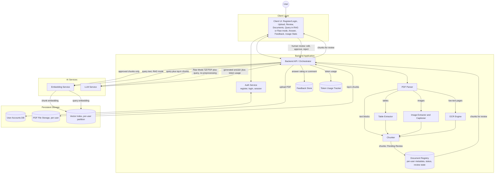
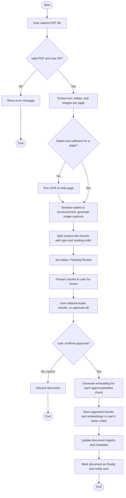
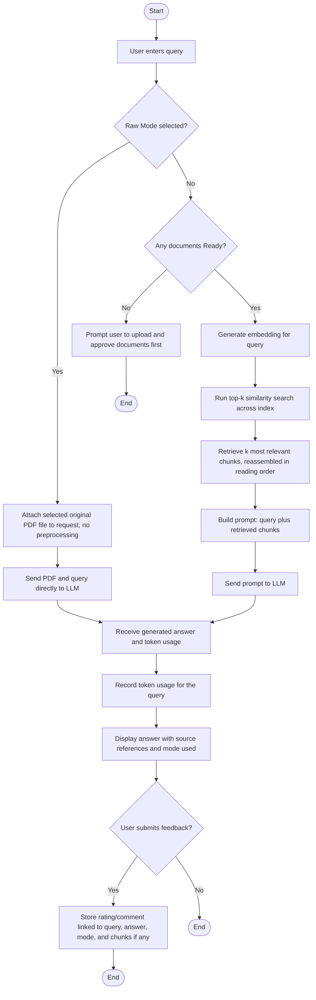
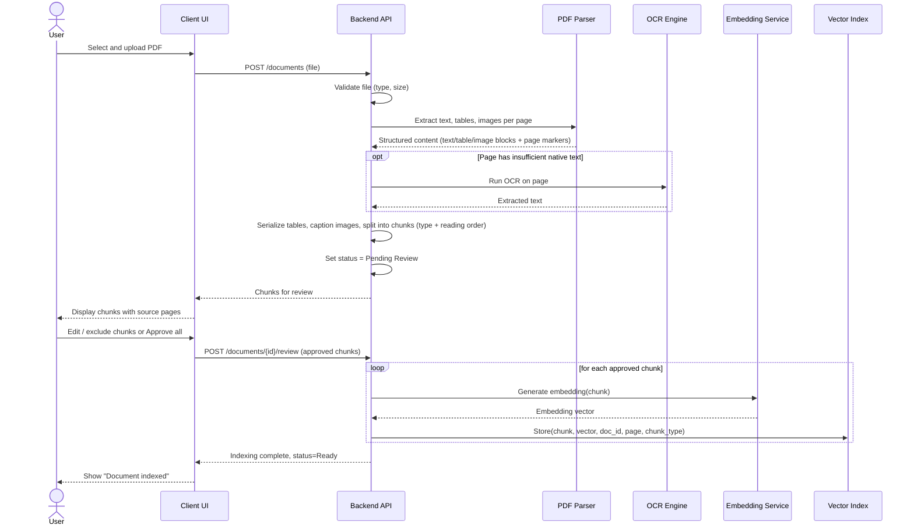
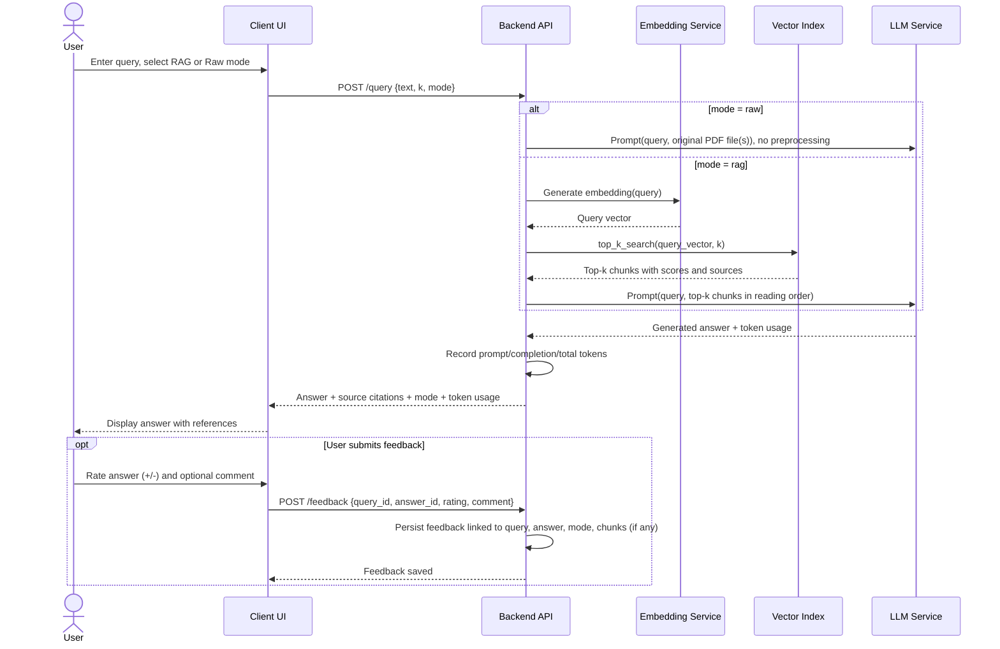

# Software Design Document (SDD)
## PDF Question-Answering System (Retrieval-Augmented Generation)

**Version:** 1.0
**Date:** 2026-09-11
**Status:** Draft

**Companion document:** This SDD is accompanied by a separate **Software Requirements Specification (SRS)** — `SRS_PDF_QA_System.md` — which defines **what** the system must do (functional/non-functional requirements, FR-#/NFR-# IDs referenced throughout this document). This SDD defines **how** those requirements are met: architecture, technology choices, design rationale, process flows, and data schema.

---

## 1. Introduction

### 1.1 Purpose
This document describes the design of the PDF Question-Answering System specified in the SRS: the technical decisions behind key features, the technology stack, the system architecture, the process flows (activity and sequence diagrams), and the database schema. It also records design decisions that are intentionally left open for the implementation phase.

### 1.2 Scope
This SDD covers the same feature set as the SRS (v3.0): multi-user authentication, PDF ingestion with OCR/table/image handling and human-in-the-loop review, RAG-mode and Raw-mode querying, feedback capture, and token-usage tracking. It does not restate the requirements themselves — see the SRS for FR-#/NFR-# definitions — and it does not cover the future-work items listed in SRS §8.

### 1.3 References
- `SRS_PDF_QA_System.md` — companion Software Requirements Specification (all FR-#/NFR-# IDs used below are defined there)

---

## 2. Design Rationale & Key Technical Decisions

This section documents the reasoning behind three design questions raised during review, so it is preserved alongside the design it informs.

### 2.1 Handling Chunked Text, Tables, and Images Together
*(Realizes FR-6, FR-8, FR-9, FR-10, FR-18)*

During parsing, each PDF page is decomposed by content type rather than treated as a single text blob:
- **Text blocks** are extracted as plain text.
- **Tables** are detected and serialized into a structured, indexable form (e.g., a Markdown table) instead of being flattened into paragraph text, so row/column structure is preserved for the LLM to reason over.
- **Images/figures** are extracted as files; since raw pixel data is not directly comparable to text embeddings in this design, each image is given an indexable caption/description (from any nearby caption text in the PDF, or auto-generated) while the original image file is retained and linked.

All three chunk types share one chunk schema (§7) and are embedded into the same vector space so a single top-k search can return a mix of text, table, and image-caption chunks. Each chunk record carries a `chunk_type` (`text` | `table` | `image`) and a `reading_order` index within its page. When retrieval returns multiple chunks from the same page or table, the backend reassembles them in their original reading order before building the LLM prompt, rather than presenting the LLM with an unordered bag of fragments — this keeps multi-part content (e.g., a paragraph referring to an adjacent table) coherent in the final prompt. (Ordering of chunks that come from *different* documents is an open item — see §8, OD-6.)

### 2.2 Using User Feedback to Improve System Performance
*(Realizes FR-23, FR-24)*

Feedback is captured per answer and linked to the query, the answer, the chunks actually used (in RAG Mode), and the mode used. In this version it is used as follows:
- **Quality monitoring:** aggregating ratings per document or chunk surfaces weak spots — e.g., a chunk or document that repeatedly receives negative feedback may indicate poor OCR, bad table parsing, or a chunk boundary that cuts off relevant context.
- **Retrieval evaluation:** feedback tied to the specific chunks used for an answer acts as an implicit relevance judgment. Over time this becomes a small labeled dataset the team can use to estimate retrieval precision (e.g., precision@k) and compare configurations (chunk size, k, embedding model).
- **Prompt/parameter tuning:** recurring patterns in negative feedback (e.g., "wrong document", "answer not grounded in the text") can guide manual adjustments to chunk size, the value of k, or the prompt template.
- **Future automation:** the accumulated (query, retrieved chunks, answer, rating) records can later feed a re-ranking model or few-shot prompt examples; this is intentionally deferred to future work (SRS §8) so the current release keeps a simple, auditable, offline feedback loop rather than an opaque online one.

In the current design, feedback is stored and reviewable (e.g., by exporting or querying the Feedback table), but is **not** automatically applied in real time.

### 2.3 Top-k Retrieval: Rationale and Alternatives
*(Realizes FR-17; informs NFR-3, NFR-8)*

**What it does:** top-k ranks all indexed chunks by vector similarity to the query embedding and returns the *k* highest-scoring ones.

**Why it was chosen as the default:**
- Simple to implement and reason about, with a small, well-understood parameter (*k*).
- Fast at this project's scale, especially with an approximate-nearest-neighbor index (NFR-8).
- Finds semantically related passages even when the query does not share exact keywords with the source text — the main advantage over pure keyword search.
- Embedding-model agnostic: works with any embedding function without hand-written matching rules.
- Cost and latency scale predictably with *k*, which keeps token usage (SRS §4.8) easier to reason about.

**Alternatives considered, and when they would be better:**
| Method | Advantage over plain top-k | Trade-off |
|---|---|---|
| Keyword / BM25 (sparse) search | Strong for exact terms, codes, numbers, names that embeddings can miss | Misses paraphrased/semantically related content |
| Hybrid search (dense + sparse, e.g., score fusion) | Combines both strengths above | More moving parts to build, tune, and maintain |
| Cross-encoder re-ranking on top of top-k | Higher precision by re-scoring a small candidate set with a more accurate (but slower) model | Adds latency and cost; only re-scores what top-k already retrieved |
| Graph-based retrieval | Better for multi-hop/relational questions ("what does document A say that relates to a table in document B?") | Requires building and maintaining a knowledge graph |

**Conclusion:** plain top-k similarity search is used as the primary/default retrieval method because it gives the best balance of simplicity, latency, and answer quality at the ~100-document-per-user scale defined in the SRS. Because retrieval is isolated behind a single interface in the architecture (the Vector Index component in §4), hybrid search, re-ranking, or graph-based retrieval can be layered in later (SRS §8) without a fundamental redesign.

---

## 3. Technology Stack

A standard, widely-adopted **Python-based RAG stack**, appropriate for a multi-user system operating at the ~100-document-per-user scale defined in the SRS. Exact components remain swappable per NFR-20.

| Layer | Component | Recommended Technology | Notes / Alternatives |
|---|---|---|---|
| Language | Core language | Python 3.11+ | — |
| Backend | API framework | FastAPI | Async support, auto-generated OpenAPI docs |
| Backend | Authentication | FastAPI's OAuth2/JWT pattern (`python-jose`) + `passlib[bcrypt]` for password hashing | Alternative: a session-cookie-based auth library if JWT is not desired |
| Client | UI | Streamlit, or a lightweight React/Next.js front-end | Streamlit is fastest to build for this scope; React/Next.js if a more custom multi-page UI (login, review, chat, stats) is preferred |
| Ingestion | PDF text/layout parsing | PyMuPDF (`fitz`) | Fast text + page-level extraction; alternative: `pdfplumber` |
| Ingestion | Table extraction | Camelot or `pdfplumber` table detection | Serializes detected tables to Markdown (§2.1, FR-8) |
| Ingestion | Image extraction & captioning | PyMuPDF for image extraction; captioning via a vision-capable LLM call or a local model (e.g., BLIP) | Configurable per NFR-20; exact approach is an open decision — see §8, OD-4 |
| Ingestion | OCR | Tesseract OCR via `pytesseract` | Alternative: a cloud OCR API for higher accuracy on difficult scans |
| Ingestion | Chunking & RAG orchestration | LangChain (or LlamaIndex) | Text splitters and RAG pipeline glue |
| AI Services | Embedding model | `sentence-transformers` (e.g., `all-MiniLM-L6-v2`), local | Alternative: an API-based embedding model for higher quality |
| Storage | Vector store | Chroma | Embedded, persistent, supports per-user partitioning/filtering at the ~100-document, tens-of-thousands-of-chunk scale; alternatives: FAISS, Qdrant. Partitioning strategy is an open decision — see §8, OD-5 |
| AI Services | LLM (RAG & Raw Mode) | Configurable — an API-based LLM by default (supports both text prompts and file/document input for Raw Mode) | Optional local inference (e.g., via Ollama) for offline use |
| AI Services | Token accounting | Provider-reported `usage` fields (prompt/completion/embedding tokens) | `tiktoken`-based local estimate as a fallback (NFR-24) |
| Storage | Users, metadata, review status, feedback, token usage | SQLite | Lightweight, file-based; stores the schema in §7. For a larger number of concurrent users, migrating to PostgreSQL is a maintainability consideration, not a required change now. |
| Deployment | Packaging | Docker | Single container (or docker-compose) bundling backend, vector store, and database |
| Quality | Testing | pytest | Unit/integration tests for auth, ingestion, retrieval, and API layers |

---

## 4. System Architecture Overview

The backend orchestrates four flows: **authentication** (register/login/session), **ingestion with human review** (parse → OCR/tables/images as needed → chunk → present for review → embed & index approved chunks), **querying** in RAG Mode or Raw Mode, and **feedback/token-usage capture**. All per-user data (files, index entries, registry, feedback, token usage) is partitioned by `user_id` (realizes NFR-9, NFR-17).

**Layer summary**

| Layer | Component | Responsibility |
|---|---|---|
| Client | Client UI | Register/log in, upload PDFs, review/approve/edit chunks, list/delete documents, submit queries in RAG or Raw mode, display answers with citations, submit feedback, show token-usage stats |
| Backend | Auth Service | Handles registration, login/logout, and session/token validation |
| Backend | Backend API / Orchestrator | Coordinates auth, ingestion (incl. review), query (both modes), feedback, and token-usage flows |
| Backend | PDF Parser | Extracts raw text, tables, images, and page boundaries from uploaded PDFs |
| Backend | Table Extractor | Detects tables and serializes them into structured, indexable text |
| Backend | Image Extractor and Captioner | Extracts images and generates indexable captions/descriptions |
| Backend | OCR Engine | Extracts text from scanned/image-based pages |
| Backend | Chunker | Splits extracted content into indexable, page- and order-traceable chunks |
| Backend | Document Registry | Tracks per-user document metadata, ingestion status, and per-chunk review state |
| Backend | Feedback Store | Persists user ratings/comments on answers, linked to query, answer, mode, and chunks used |
| Backend | Token Usage Tracker | Records prompt/completion/embedding token counts per query |
| AI Services | Embedding Service | Converts approved chunks and queries into vectors |
| AI Services | LLM Service | Generates the final answer, either from RAG-style context or directly from a raw PDF plus query (Raw Mode); reports token usage |
| Storage | User Accounts DB | Stores registered users and hashed credentials |
| Storage | PDF File Storage | Persists the original uploaded PDF files, per user |
| Storage | Vector Index / Store | Persists **approved** chunk embeddings and metadata, partitioned per user; serves top-k similarity search |

---

## 5. Activity Diagrams

### 5.1 Activity Diagram — PDF Upload & Ingestion (OCR, Tables, Images, Human Review)
*(Realizes FR-4 through FR-15)*

### 5.2 Activity Diagram — Query, Answer Generation & Feedback (RAG Mode and Raw Mode)
*(Realizes FR-16 through FR-24)*

---

## 6. Sequence Diagrams

### 6.1 Sequence Diagram — Document Upload with OCR and Human Review
*(Realizes FR-4 through FR-15)*

### 6.2 Sequence Diagram — Query, Answer Generation & Feedback (RAG or Raw Mode)
*(Realizes FR-16 through FR-24)*

---

## 7. Data Model (Database Design)

Detailed, attribute-level schema realizing the conceptual entities listed in SRS §7.

| Entity | Key Attributes |
|---|---|
| User | id, username/email, password_hash, created_at |
| Document | id, user_id, filename, upload_date, status (uploaded/extracting/ocr/pending_review/indexing/ready/failed), page_count |
| Chunk | id, document_id, page_number, chunk_type (text/table/image), text (or table_markdown / image_caption), image_path (nullable), reading_order, review_status (pending/approved/edited/rejected), reviewed_at |
| Embedding | chunk_id, vector, embedding_model_version |
| Query | id, user_id, text, timestamp, k_value, mode (rag/raw) |
| Answer | id, query_id, generated_text, source_chunk_ids (nullable for Raw Mode), llm_model_version, prompt_tokens, completion_tokens, total_tokens |
| Feedback | id, query_id, answer_id, rating (positive/negative), comment, timestamp |

---

## 8. Open Design Decisions

The following design points are intentionally left open. Each should be resolved (or at least given a working default) before or during implementation; none of them are blocked by, or block, the requirements in the SRS.

| ID | Open Decision | Related Requirement(s) | Notes |
|---|---|---|---|
| OD-1 | Default chunk size and overlap | FR-10 | No concrete character/token count has been chosen yet; needs a starting value plus a note on how it interacts with table/image chunks, which don't split the same way as prose. |
| OD-2 | Default value and valid range for *k* | FR-17, FR-27 | "Sensible default range" is not yet quantified. |
| OD-3 | OCR trigger threshold | FR-7 | Needs a concrete rule (e.g., minimum extracted character count per page) below which OCR is invoked, rather than a qualitative "insufficient" check. |
| OD-4 | Image captioning approach | FR-9, §3 (Tech Stack) | Undecided between a vision-capable LLM call per image vs. a local captioning model; also affects cost (ties into token-usage tracking) and caption format. |
| OD-5 | Vector store partitioning strategy | NFR-9, §3, §4 | Undecided between a separate Chroma collection per user vs. a single collection filtered by a `user_id` metadata field; affects isolation guarantees (NFR-17) and query performance at scale. |
| OD-6 | Cross-document chunk ordering | §2.1, FR-18 | Reading-order reassembly is defined for chunks from the *same* page/document; when top-k returns chunks from multiple different documents, how they should be grouped/ordered before prompt assembly is not yet specified. |
| OD-7 | Raw Mode size/context-window limits | FR-20, FR-28 | No defined strategy (reject, truncate, warn) for when the user's selected PDF(s) exceed the LLM's context window in Raw Mode. |
| OD-8 | Document re-upload/update semantics | FR-29 | Not yet specified whether re-uploading a document versions it, replaces it outright, or requires the user to manually delete the old one first — and what happens to feedback tied to the old chunks. |
| OD-9 | Evaluation methodology | §2.2 (feedback usage) | Ground-truth construction and the precise definition of retrieval/answer-quality metrics (e.g., precision@k) are not yet designed; needed to make use of the feedback loop described in §2.2. |
| OD-10 | Prompt template for grounding | FR-19 | The exact prompt structure/instructions used to keep RAG-Mode answers grounded in the retrieved chunks (and reduce hallucination) is an implementation detail not yet drafted. |
