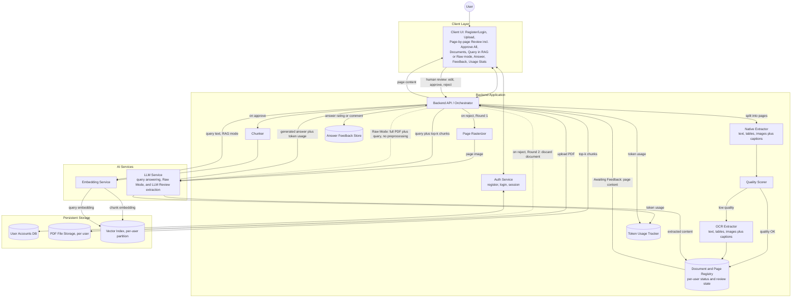
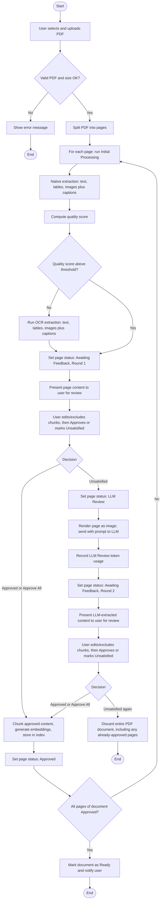
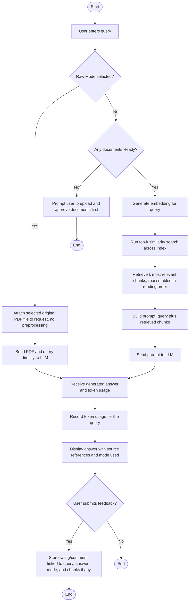
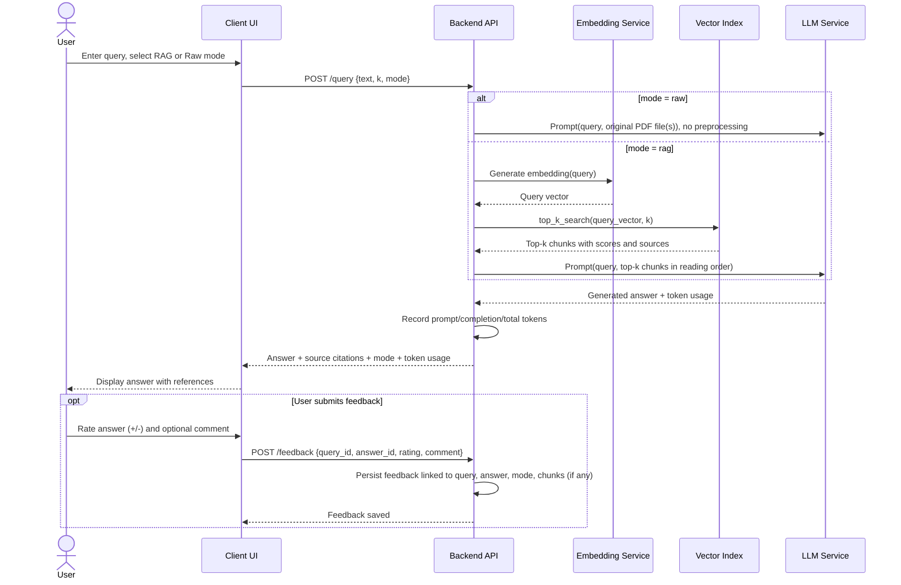

# Software Design Document (SDD)
## PDF Question-Answering System (Retrieval-Augmented Generation)

**Version:** 2.0
**Date:** 2026-09-12
**Status:** Draft

**Companion document:** This SDD is accompanied by a separate **Software Requirements Specification (SRS)** — `SRS_PDF_QA_System.md` — which defines **what** the system must do (functional/non-functional requirements, FR-#/NFR-# IDs referenced throughout this document). This SDD defines **how** those requirements are met: architecture, technology choices, design rationale, process flows, and data schema.

---

## 1. Introduction

### 1.1 Purpose
This document describes the design of the PDF Question-Answering System specified in the SRS: the technical decisions behind key features, the technology stack, the system architecture, the process flows (activity and sequence diagrams), and the database schema. It also records design decisions that are intentionally left open for the implementation phase.

### 1.2 Scope
This SDD covers the same feature set as the SRS (v4.0): multi-user authentication, page-level PDF ingestion (native extraction, quality scoring, OCR, human review, LLM-based extraction escalation, and document discard), RAG-mode and Raw-mode querying, answer feedback, and token-usage tracking. It does not restate the requirements themselves — see the SRS for FR-#/NFR-# definitions — and it does not cover the future-work items listed in SRS §8.

### 1.3 References
- `SRS_PDF_QA_System.md` — companion Software Requirements Specification (all FR-#/NFR-# IDs used below are defined there)

---

## 2. Design Rationale & Key Technical Decisions

This section documents the reasoning behind the system's key design decisions, so it is preserved alongside the design it informs.

### 2.1 Page-Level Extraction Pipeline and Escalation Strategy
*(Realizes FR-6 through FR-17; informs NFR-1, NFR-3, NFR-11, NFR-15)*

Ingestion operates on individual **pages**, not whole documents, so that review effort and extraction cost are spent only where needed:

1. **Initial Processing (cheapest, tried first):** every page is parsed natively (fast, no LLM/OCR cost) to extract text, tables, and images with captions.
2. **Quality gate (automatic, no human involved):** a quality score is computed on the native-extraction output. Only pages that score below a configurable threshold fall through to OCR — most digital-native pages skip OCR entirely, keeping ingestion fast and cheap for the common case.
3. **Human review, Round 1 ("Awaiting Feedback"):** whatever content Initial Processing produced (native or OCR) is shown to the user. This is the first and cheapest human checkpoint.
4. **LLM Review (most expensive, last resort, only on human signal):** only if the user actively marks Round‑1 content unsatisfactory does the system pay for an LLM call — rendering the page as an image and asking an LLM (main or a lighter/cheaper model, per NFR-25) to extract text, tables, and images with captions.
5. **Human review, Round 2:** the LLM Review result is shown to the user for a second check.
6. **Discard on repeated rejection:** if the user is unsatisfied even after LLM Review, the whole document is discarded rather than indexing a page the user has twice rejected, or looping indefinitely. This keeps the corpus limited to content the user has actually approved, and bounds the cost of any one document to at most one LLM Review call per page.

This "cheap-first, escalate-only-on-signal" ladder is the core cost/quality trade-off of the ingestion design: native parsing and the automatic quality gate handle the bulk of pages for free; OCR handles genuinely low-quality pages; and the LLM Review call — the only step with meaningful per-page LLM cost — is reserved for the minority of pages a human has actually flagged as wrong.

### 2.2 Handling Chunked Text, Tables, and Images Together
*(Realizes FR-8, FR-10, FR-14, FR-18, FR-19, FR-20, FR-26)*

All three extraction methods used in §2.1 — native parsing, OCR, and LLM Review — are required to produce the same three content types for a page:
- **Text blocks**, extracted as plain text.
- **Tables**, serialized into a structured, indexable form (e.g., a Markdown table) instead of being flattened into paragraph text, so row/column structure is preserved for the LLM to reason over.
- **Images/figures**, extracted as files; since raw pixel data is not directly comparable to text embeddings in this design, each image is given an indexable caption/description (from any nearby caption text, or auto-generated) while the original image file is retained and linked.

Producing the same three content types regardless of which extraction method was used means downstream chunking, review, and indexing logic does not need to know which method produced a given page's content. All chunk types share one chunk schema (§7) and are embedded into the same vector space so a single top-k search can return a mix of text, table, and image-caption chunks. Each chunk record carries a `chunk_type` (`text` | `table` | `image`) and a `reading_order` index within its page. When retrieval returns multiple chunks from the same page, the backend reassembles them in their original reading order before building the LLM prompt. (Ordering of chunks that come from *different* documents is an open item — see §8, OD-6.)

### 2.3 Using User Feedback to Improve System Performance
*(Realizes FR-31, FR-32)*

Answer feedback is captured per answer and linked to the query, the answer, the chunks actually used (in RAG Mode), and the mode used. In this version it is used as follows:
- **Quality monitoring:** aggregating ratings per document or chunk surfaces weak spots — e.g., a chunk or document that repeatedly receives negative feedback may indicate poor extraction, a chunk boundary that cuts off relevant context, or a page that only passed review after LLM Review.
- **Retrieval evaluation:** feedback tied to the specific chunks used for an answer acts as an implicit relevance judgment. Over time this becomes a small labeled dataset the team can use to estimate retrieval precision (e.g., precision@k) and compare configurations (chunk size, k, embedding model).
- **Prompt/parameter tuning:** recurring patterns in negative feedback (e.g., "wrong document", "answer not grounded in the text") can guide manual adjustments to chunk size, the value of k, or the prompt template.
- **Future automation:** the accumulated (query, retrieved chunks, answer, rating) records can later feed a re-ranking model or few-shot prompt examples; this is intentionally deferred to future work (SRS §8) so the current release keeps a simple, auditable, offline feedback loop rather than an opaque online one.

In the current design, feedback is stored and reviewable (e.g., by exporting or querying the Feedback table), but is **not** automatically applied in real time.

### 2.4 Top-k Retrieval: Rationale and Alternatives
*(Realizes FR-25; informs NFR-4, NFR-9)*

**What it does:** top-k ranks all indexed chunks by vector similarity to the query embedding and returns the *k* highest-scoring ones.

**Why it was chosen as the default:**
- Simple to implement and reason about, with a small, well-understood parameter (*k*).
- Fast at this project's scale, especially with an approximate-nearest-neighbor index (NFR-9).
- Finds semantically related passages even when the query does not share exact keywords with the source text — the main advantage over pure keyword search.
- Embedding-model agnostic: works with any embedding function without hand-written matching rules.
- Cost and latency scale predictably with *k*, which keeps token usage (SRS §4.8) easier to reason about.

**Alternatives considered, and when they would be better:**
| Method | Advantage over plain top-k | Trade-off |
|---|---|---|
| Keyword / BM25 (sparse) search | Strong for exact terms, codes, numbers, names that embeddings can miss | Misses paraphrased/semantically related content |
| Hybrid search (dense + sparse, e.g., score fusion) | Combines both strengths above | More moving parts to build, tune, and maintain |
| Cross-encoder re-ranking on top of top-k | Higher precision by re-scoring a small candidate set with a more accurate (but slower) model | Adds latency and cost; only re-scores what top-k already retrieved |
| Graph-based retrieval | Better for multi-hop/relational questions ("what does document A say that relates to a table in document B?") | Requires building and maintaining a knowledge graph |

**Conclusion:** plain top-k similarity search is used as the primary/default retrieval method because it gives the best balance of simplicity, latency, and answer quality at the ~100-document-per-user scale defined in the SRS. Because retrieval is isolated behind a single interface in the architecture (the Vector Index component in §4), hybrid search, re-ranking, or graph-based retrieval can be layered in later (SRS §8) without a fundamental redesign.

---

## 3. Technology Stack

A standard, widely-adopted **Python-based RAG stack**, appropriate for a multi-user system operating at the ~100-document-per-user scale defined in the SRS. Exact components remain swappable per NFR-25.

| Layer | Component | Recommended Technology | Notes / Alternatives |
|---|---|---|---|
| Language | Core language | Python 3.11+ | — |
| Backend | API framework | FastAPI | Async support, auto-generated OpenAPI docs |
| Backend | Authentication | FastAPI's OAuth2/JWT pattern (`python-jose`) + `passlib[bcrypt]` for password hashing | Alternative: a session-cookie-based auth library if JWT is not desired |
| Client | UI | Streamlit, or a lightweight React/Next.js front-end | Streamlit is fastest to build for this scope; React/Next.js if a more custom multi-page UI (login, page-by-page review, chat, stats) is preferred |
| Ingestion | Native PDF text/layout parsing | PyMuPDF (`fitz`) | Fast text + page-level extraction; alternative: `pdfplumber` |
| Ingestion | Table extraction | Camelot or `pdfplumber` table detection | Used within both the native and OCR extraction paths; serializes tables to Markdown (§2.2, FR-18) |
| Ingestion | Image extraction & captioning | PyMuPDF for image extraction; captioning via a vision-capable LLM call or a local model (e.g., BLIP) | Configurable per NFR-25; exact approach is an open decision — see §8, OD-4 |
| Ingestion | Quality scoring | A lightweight heuristic (e.g., extracted-character density, ratio of recognizable words, garbled-character ratio) computed in Python without an external call | Exact metric/formula is an open decision — see §8, OD-3 |
| Ingestion | OCR | Tesseract OCR via `pytesseract`, combined with the same table/image extraction logic used natively | Alternative: a cloud OCR/Document-AI API for higher accuracy and native table/figure detection on difficult scans |
| Ingestion | Page rasterization (for LLM Review) | PyMuPDF (`page.get_pixmap()`) to render a page to an image | — |
| Ingestion | LLM Review extraction | A vision-capable LLM call (main LLM or a lighter/cheaper model) with a page image and an extraction prompt | Prompt design and model choice are open decisions — see §8, OD-11, OD-12 |
| Ingestion | Chunking & RAG orchestration | LangChain (or LlamaIndex) | Text splitters and RAG pipeline glue |
| AI Services | Embedding model | `sentence-transformers` (e.g., `all-MiniLM-L6-v2`), local | Alternative: an API-based embedding model for higher quality |
| Storage | Vector store | Chroma | Embedded, persistent, supports per-user partitioning/filtering at the ~100-document, tens-of-thousands-of-chunk scale; alternatives: FAISS, Qdrant. Partitioning strategy is an open decision — see §8, OD-5 |
| AI Services | LLM (RAG & Raw Mode answering) | Configurable — an API-based LLM by default (supports both text prompts and file/document input for Raw Mode) | Optional local inference (e.g., via Ollama) for offline use |
| AI Services | Token accounting | Provider-reported `usage` fields (prompt/completion/embedding tokens), recorded for both query answering and LLM Review calls | `tiktoken`-based local estimate as a fallback (NFR-29) |
| Storage | Users, documents, pages, chunks, review status, feedback, token usage | SQLite | Lightweight, file-based; stores the schema in §7. For a larger number of concurrent users, migrating to PostgreSQL is a maintainability consideration, not a required change now. |
| Deployment | Packaging | Docker | Single container (or docker-compose) bundling backend, vector store, and database |
| Quality | Testing | pytest | Unit/integration tests for auth, the page-level ingestion pipeline, retrieval, and API layers |

---

## 4. System Architecture Overview

The backend orchestrates four flows: **authentication** (register/login/session), **page-level ingestion with human review** (native extraction → quality gate → OCR if needed → human review → LLM Review if rejected → human review again → approve or discard), **querying** in RAG Mode or Raw Mode, and **answer feedback/token-usage capture**. All per-user data (files, index entries, registry, feedback, token usage) is partitioned by `user_id` (realizes NFR-10, NFR-21).



**Layer summary**

| Layer | Component | Responsibility |
|---|---|---|
| Client | Client UI | Register/log in, upload PDFs, review page content round by round (with Approve All), list/delete documents, submit queries in RAG or Raw mode, display answers with citations, submit feedback, show token-usage stats |
| Backend | Auth Service | Handles registration, login/logout, and session/token validation |
| Backend | Backend API / Orchestrator | Coordinates auth, the page-level ingestion pipeline, query (both modes), feedback, and token-usage flows |
| Backend | Native Extractor | Extracts raw text, tables, and images with captions from a page using native PDF parsing |
| Backend | Quality Scorer | Computes a quality score for a page's native extraction to decide whether OCR is needed |
| Backend | OCR Extractor | Extracts text, tables, and images with captions from a page using OCR, for pages that fail the quality gate |
| Backend | Page Rasterizer | Renders a page as an image for LLM Review |
| Backend | Chunker | Splits an approved page's content into indexable, type- and order-traceable chunks |
| Backend | Document and Page Registry | Tracks per-user document metadata and per-page status/review state through the full lifecycle |
| Backend | Answer Feedback Store | Persists user ratings/comments on answers, linked to query, answer, mode, and chunks used |
| Backend | Token Usage Tracker | Records prompt/completion/embedding token counts for both query answering and LLM Review calls |
| AI Services | Embedding Service | Converts approved chunks and queries into vectors |
| AI Services | LLM Service | Generates query answers (RAG or Raw Mode) and performs LLM Review page-image extraction; reports token usage for both |
| Storage | User Accounts DB | Stores registered users and hashed credentials |
| Storage | PDF File Storage | Persists the original uploaded PDF files, per user |
| Storage | Vector Index / Store | Persists **approved** chunk embeddings and metadata, partitioned per user; serves top-k similarity search |

---

## 5. Activity Diagrams

### 5.1 Activity Diagram — Page-Level Ingestion Pipeline
*(Realizes FR-4 through FR-23)*



### 5.2 Activity Diagram — Query, Answer Generation & Feedback (RAG Mode and Raw Mode)
*(Realizes FR-24 through FR-32)*



---

## 6. Sequence Diagrams

### 6.1 Sequence Diagram — Page-Level Ingestion (Native/OCR, Human Review, LLM Review Escalation)
*(Realizes FR-4 through FR-23)*

```mermaid
sequenceDiagram
    actor U as User
    participant UI as Client UI
    participant API as Backend API
    participant NAT as Native Extractor
    participant QUAL as Quality Scorer
    participant OCR as OCR Extractor
    participant RAST as Page Rasterizer
    participant LLM as LLM Service
    participant EMB as Embedding Service
    participant IDX as Vector Index
    participant TOK as Token Usage Tracker

    U->>UI: Upload PDF
    UI->>API: POST /documents (file)
    API->>API: Validate file; split into pages
    loop for each page
        API->>NAT: Extract text, tables, images plus captions
        NAT-->>API: Extracted content
        API->>QUAL: Score quality
        QUAL-->>API: Quality score
        alt Quality below threshold
            API->>OCR: Extract text, tables, images plus captions
            OCR-->>API: Extracted content
        end
        API->>API: Set page status = Awaiting Feedback, Round 1
        API-->>UI: Page content for review
        UI-->>U: Display page content
        U->>UI: Edit/exclude chunks; Approve, Approve All, or mark Unsatisfied
        UI->>API: POST /pages/{id}/review {decision}
        alt Approved
            API->>EMB: Generate embeddings for approved chunks
            EMB-->>API: Vectors
            API->>IDX: Store chunks and vectors
            API->>API: Set page status = Approved
        else Unsatisfied
            API->>API: Set page status = LLM Review
            API->>RAST: Render page as image
            RAST-->>API: Page image
            API->>LLM: Extract text, tables, images plus captions (prompt + page image)
            LLM-->>API: Extracted content + token usage
            API->>TOK: Record LLM Review token usage
            API->>API: Set page status = Awaiting Feedback, Round 2
            API-->>UI: LLM-extracted page content for review
            UI-->>U: Display page content
            U->>UI: Edit/exclude chunks; Approve or mark Unsatisfied
            UI->>API: POST /pages/{id}/review {decision}
            alt Approved
                API->>EMB: Generate embeddings for approved chunks
                EMB-->>API: Vectors
                API->>IDX: Store chunks and vectors
                API->>API: Set page status = Approved
            else Unsatisfied again
                API->>API: Discard entire document (files, pages, chunks, embeddings)
                API-->>UI: Document discarded
                UI-->>U: Notify document discarded
            end
        end
    end
    API-->>UI: All pages Approved, document status = Ready
    UI-->>U: Show "Document indexed"
```

### 6.2 Sequence Diagram — Query, Answer Generation & Feedback (RAG or Raw Mode)
*(Realizes FR-24 through FR-32)*



---

## 7. Data Model (Database Design)

Detailed, attribute-level schema realizing the conceptual entities listed in SRS §7.

| Entity | Key Attributes |
|---|---|
| User | id, username/email, password_hash, created_at |
| Document | id, user_id, filename, upload_date, status (uploaded/processing/awaiting_feedback/ready/discarded/failed), page_count |
| Page | id, document_id, page_number, status (initial_processing/awaiting_feedback/llm_review/approved), extraction_method (native/ocr/llm_vision), quality_score (nullable), review_round (1/2), updated_at |
| Chunk | id, page_id, chunk_type (text/table/image), text (or table_markdown / image_caption), image_path (nullable), reading_order, review_status (pending/approved/edited/rejected), reviewed_at |
| Embedding | chunk_id, vector, embedding_model_version |
| Query | id, user_id, text, timestamp, k_value, mode (rag/raw) |
| Answer | id, query_id, generated_text, source_chunk_ids (nullable for Raw Mode), llm_model_version |
| Feedback | id, query_id, answer_id, rating (positive/negative), comment, timestamp |
| TokenUsage | id, user_id, context_type (query/llm_review), context_id (references Answer.id or Page.id, depending on context_type), model_used, prompt_tokens, completion_tokens, total_tokens, timestamp |

---

## 8. Open Design Decisions

The following design points are intentionally left open. Each should be resolved (or at least given a working default) before or during implementation; none of them are blocked by, or block, the requirements in the SRS.

| ID | Open Decision | Related Requirement(s) | Notes |
|---|---|---|---|
| OD-1 | Default chunk size and overlap | FR-20 | No concrete character/token count has been chosen yet; needs a starting value plus a note on how it interacts with table/image chunks, which don't split the same way as prose. |
| OD-2 | Default value and valid range for *k* | FR-25, FR-35 | "Sensible default range" is not yet quantified. |
| OD-3 | Quality-score metric definition and threshold | FR-9, FR-10 | The metric formula (e.g., extracted-character density, garbled-character ratio, expected-vs-actual content length) and the numeric threshold below which OCR is triggered are not yet defined. |
| OD-4 | Image captioning approach | FR-19, §3 (Tech Stack) | Undecided between a vision-capable LLM call per image vs. a local captioning model; also affects cost and caption format; applies across all three extraction methods. |
| OD-5 | Vector store partitioning strategy | NFR-10, §3, §4 | Undecided between a separate Chroma collection per user vs. a single collection filtered by a `user_id` metadata field. |
| OD-6 | Cross-document chunk ordering | §2.2, FR-26 | Reading-order reassembly is defined for chunks from the *same* page; when top-k returns chunks from multiple different documents, how they should be grouped/ordered before prompt assembly is not yet specified. |
| OD-7 | Raw Mode size/context-window limits | FR-28, FR-36 | No defined strategy (reject, truncate, warn) for when the user's selected PDF(s) exceed the LLM's context window in Raw Mode. |
| OD-8 | Document re-upload/update semantics | FR-37 | Not yet specified whether re-uploading a document versions it, replaces it outright, or requires the user to manually delete the old one first — and how this interacts with pages that were already Approved. |
| OD-9 | Evaluation methodology | §2.3 (feedback usage) | Ground-truth construction and the precise definition of retrieval/answer-quality metrics (e.g., precision@k) are not yet designed. |
| OD-10 | Prompt template for answer grounding | FR-27 | The exact prompt structure/instructions used to keep RAG-Mode answers grounded in the retrieved chunks (and reduce hallucination) is not yet drafted. |
| OD-11 | Prompt template for LLM Review extraction | FR-14 | The exact prompt given to the LLM along with a page image — what output format it must return (e.g., JSON with typed blocks), and how it should handle tables/images within that format — is not yet drafted. |
| OD-12 | Choice of "lighter" LLM for LLM Review | FR-14, §3 (Tech Stack) | Whether to reuse the main answering LLM or a specific smaller/cheaper model for LLM Review, and the cost/accuracy criteria for that choice, is not yet decided. |
| OD-13 | Granularity of quality scoring | FR-9 | Whether the quality score is computed once per whole page, or separately per detected block (text/table/image) — the latter would allow OCR to be triggered only for the specific low-quality elements of a page rather than the whole page. |
| OD-14 | Structure of "unsatisfied" feedback during review | FR-12, FR-14 | Whether marking a page unsatisfied is a simple binary action or also captures a free-text note from the user that could be passed into the LLM Review prompt (OD-11) as extra guidance. |
