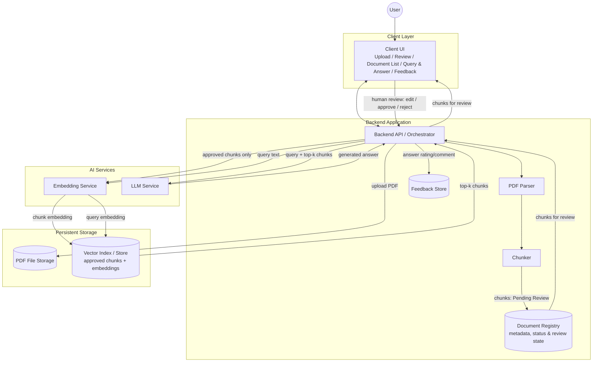
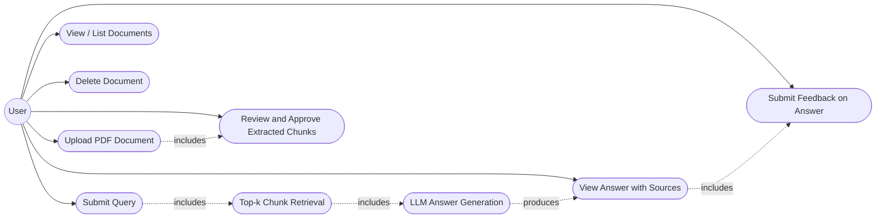
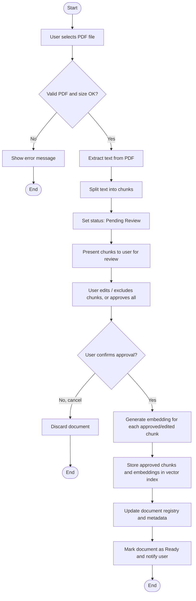
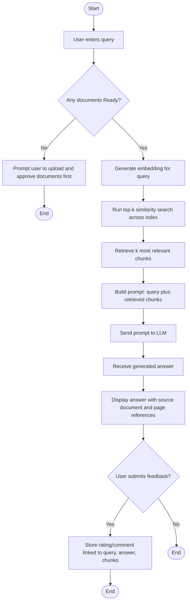
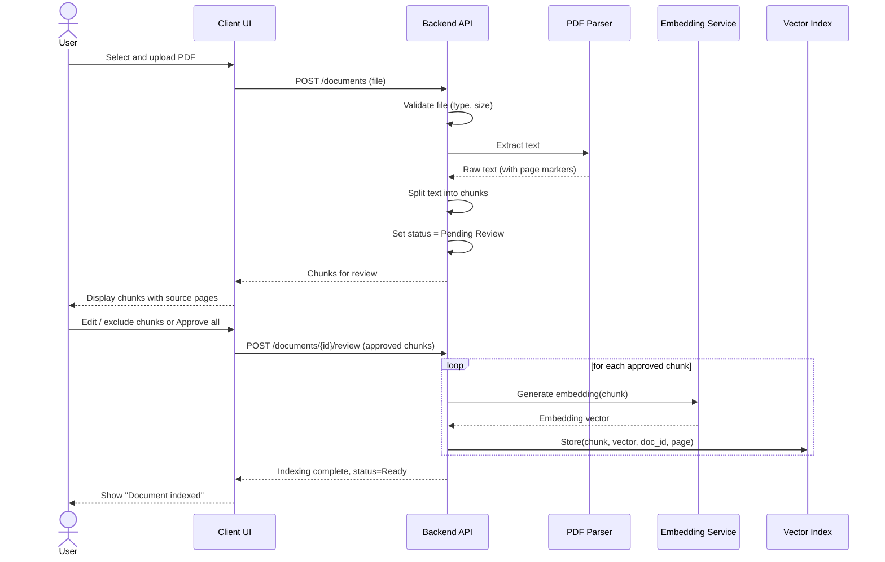
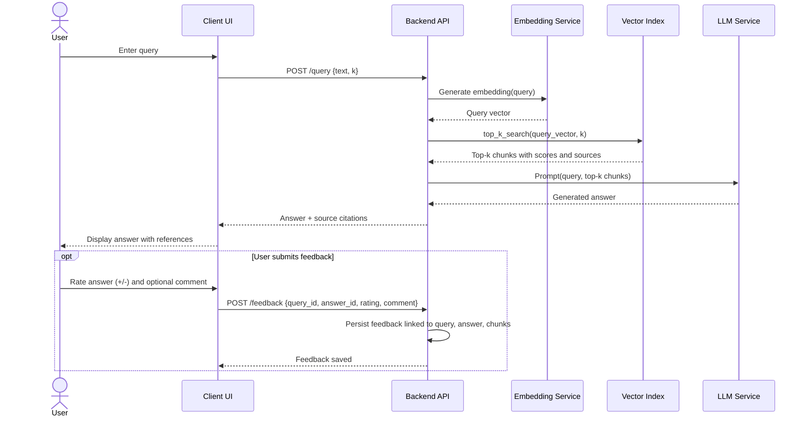

# Software Requirements Specification (SRS)
## PDF Question-Answering System (Retrieval-Augmented Generation)

**Version:** 1.1
**Date:** 2026-09-10
**Status:** Draft

---

## 1. Introduction

### 1.1 Purpose
This document specifies the software requirements for a single-user system that allows a user to upload PDF documents and ask natural-language questions about their content. The system retrieves the most relevant passages using a **top-k similarity search** and passes them, together with the user's query, to a Large Language Model (LLM) to generate a grounded answer (Retrieval-Augmented Generation, RAG). The system incorporates **human-in-the-loop (HITL)** checkpoints: the user reviews and approves extracted/chunked content before it is indexed, and the user can rate generated answers to support future improvement.

### 1.2 Scope
The system:
- Accepts PDF files uploaded directly by the user.
- Extracts and chunks the text content of each PDF, and lets the user **review and approve** that content before it is embedded and indexed (human-in-the-loop).
- Generates vector embeddings for approved chunks and stores them in a vector index.
- Accepts a user query, retrieves the top-k most relevant chunks, and sends them with the query to an LLM.
- Returns an LLM-generated answer, along with references to the source document(s)/page(s) used.
- Lets the user submit **feedback** (rating/comment) on generated answers, stored for future improvement of retrieval and prompting (human-in-the-loop).
- Is designed to operate reliably with a corpus on the order of **~100 PDF documents**.

Out of scope: multi-user accounts, authentication/authorization, document sharing/collaboration, non-PDF file formats (unless extended later), and automated/real-time re-ranking driven by feedback (feedback is collected for later, offline improvement, not live adaptation).

### 1.3 Definitions, Acronyms, Abbreviations
| Term | Definition |
|---|---|
| RAG | Retrieval-Augmented Generation — generating answers using retrieved context passed to an LLM |
| Chunk | A segment of text extracted from a document, sized for embedding and retrieval |
| Embedding | A numeric vector representation of text, used for similarity search |
| Top-k | Retrieval strategy that returns the *k* most similar chunks to a query, ranked by vector similarity |
| Vector Index / Vector Store | A data structure/database optimized for nearest-neighbor search over embeddings |
| LLM | Large Language Model used to generate the final natural-language answer |
| HITL | Human-in-the-loop — a checkpoint where a human reviews, corrects, approves, or rates system output before it is finalized or used for future improvement |

### 1.4 References
- IEEE Std 830-1998, Recommended Practice for Software Requirements Specifications
- Project discovery notes (user-provided constraints: PDF-based QA, ~100-document scale, top-k retrieval, single-user, user-driven upload, human-in-the-loop review and feedback, Python-based RAG stack)

### 1.5 Overview
Section 2 describes the product context and constraints. Section 3 lists functional requirements. Section 4 lists non-functional requirements, including scale and HITL usability considerations. Section 5 covers external interfaces. Section 6 defines the recommended Technology Stack. Section 7 gives the architecture view. Sections 8–10 present the Use Case, Activity, and Sequence diagrams. Section 11 outlines the data model. Section 12 lists open items for future iterations.

---

## 2. Overall Description

### 2.1 Product Perspective
A standalone, single-user application (web or desktop client + backend service). It is self-contained: no external user-management system is required. It depends on three external/internal capabilities: PDF parsing, an embedding model, and an LLM (either called via API or hosted locally), plus two human-in-the-loop checkpoints built into its workflow.

### 2.2 Product Functions (Summary)
- Upload and ingest PDF documents.
- Extract and chunk document text, and present it to the user for **review and approval** before indexing.
- Generate embeddings and index only approved/edited chunks.
- List and manage (delete) previously uploaded documents.
- Accept a natural-language query and return an LLM-generated, source-grounded answer.
- Collect user **feedback** on generated answers/retrieval quality for later, offline improvement.

### 2.3 User Characteristics
A single, non-technical end user who uploads their own PDF files (e.g., reports, manuals, papers, contracts), reviews extracted content, asks questions in plain language, and optionally rates the answers received. No training in retrieval or ML concepts is assumed.

### 2.4 Constraints
- No login/authentication is required (single-user, local or personal deployment).
- The corpus size is expected to reach roughly **100 PDF documents**; the design must remain responsive at this scale (see NFRs in §4).
- Retrieval must use a **top-k similarity search** strategy (not full-text/keyword search) as the primary retrieval mechanism.
- Answers must be generated by an LLM using retrieved chunks as context (RAG), not by returning raw chunks alone.
- A document's extracted/chunked content shall not be embedded and indexed until the user has reviewed and approved it (human-in-the-loop ingestion checkpoint).
- Feedback collected after an answer is generated is used only for later, offline improvement; it is not required for, and does not block, normal operation.

### 2.5 Assumptions and Dependencies
- PDFs are primarily text-based; scanned/image-only PDFs may require OCR (flagged as an optional future extension).
- An embedding service/model and an LLM (local or API-based) are available to the backend.
- The user has sufficient local storage for the uploaded PDFs and the generated vector index.
- The user is willing and available to perform the review step for each uploaded document; a bulk "approve all" option is provided to keep this practical at the ~100-document scale.

---

## 3. Functional Requirements

| ID | Requirement |
|---|---|
| FR-1 | The system shall allow the user to upload one or more PDF files through the client interface. |
| FR-2 | The system shall validate uploaded files (file type = PDF, file size within a configurable limit) before processing. |
| FR-3 | The system shall extract textual content from each accepted PDF. |
| FR-4 | The system shall split extracted text into overlapping or non-overlapping chunks of configurable size, preserving traceability to the source document and page number. |
| FR-5 | **(HITL)** The system shall present the extracted chunks to the user for review, setting the document status to "Pending Review", before any embedding or indexing occurs. |
| FR-6 | **(HITL)** The system shall allow the user to edit chunk text, exclude/reject individual chunks, or approve all chunks in bulk for a document. |
| FR-7 | The system shall generate a vector embedding for each **approved or user-edited** chunk only, and store it in the vector index together with its source metadata (document ID, page, chunk ID), and only after the user confirms the review. |
| FR-8 | The system shall display the list of currently indexed documents and their status (e.g., Uploaded, Extracting, Pending Review, Indexing, Ready, Failed). |
| FR-9 | The system shall allow the user to delete a previously uploaded document, removing its file, chunks (including any pending review data), and embeddings from the index. |
| FR-10 | The system shall accept a free-text query from the user. |
| FR-11 | The system shall generate an embedding for the query and perform a **top-k nearest-neighbor search** over the vector index to retrieve the k most relevant chunks. |
| FR-12 | The system shall construct a prompt combining the user's query and the retrieved top-k chunks, and send it to the LLM. |
| FR-13 | The system shall present the LLM-generated answer to the user, along with references to the source document(s) and page(s) the answer was grounded in. |
| FR-14 | **(HITL)** The system shall allow the user to submit feedback on a generated answer (e.g., positive/negative rating, optional free-text comment). |
| FR-15 | **(HITL)** The system shall persist submitted feedback, linked to the originating query, answer, and the chunks used, for later review and improvement of retrieval and prompting. |
| FR-16 | The system shall allow the user to configure the value of *k* (number of retrieved chunks), within a sensible default range, if advanced settings are exposed. |
| FR-17 | The system shall handle and surface errors gracefully at each stage (upload, parsing, review submission, embedding, LLM generation, feedback submission) with a user-readable message. |
| FR-18 | The system shall avoid re-processing (re-extracting/re-chunking/re-reviewing/re-embedding) a document that has already been approved and indexed, unless the user explicitly re-uploads or updates it. |

---

## 4. Non-Functional Requirements

### 4.1 Performance
- NFR-1: Ingesting a typical PDF (≈20–50 pages) shall complete extraction and chunking, up to presenting it for review, within a target time (e.g., ≤ 30 seconds), excluding external LLM/embedding network latency.
- NFR-2: A top-k query against an index sized for the full ~100-document corpus shall return retrieved chunks within ≤ 2 seconds (excluding LLM generation time).
- NFR-3: End-to-end query response (retrieval + LLM answer) should target ≤ 10–15 seconds under normal conditions.

### 4.2 Scalability (with emphasis on the ~100 PDF scale)
- NFR-4: The vector index must efficiently support the volume expected from ~100 PDFs (estimated tens of thousands of chunks, e.g., ~100 docs × ~150–300 chunks/doc). An in-memory-only structure with no persistence is **not** acceptable; the index shall be persisted to disk so the application can restart without full re-ingestion.
- NFR-5: The indexing/embedding pipeline shall support batch processing so multiple uploaded PDFs can be ingested (up to the review checkpoint) without blocking the UI or degrading query performance for already-indexed documents.
- NFR-6: The chosen vector index/search method shall be selected (or configured) so that top-k search time grows sub-linearly (e.g., approximate nearest neighbor) if the corpus is expected to grow beyond the initial ~100-document target.

### 4.3 Reliability
- NFR-7: A failure while ingesting one document shall not corrupt the index or affect retrieval for already-indexed documents.
- NFR-8: The system shall not lose previously indexed documents/embeddings, pending-review chunks, or stored feedback on restart (persistence required — see NFR-4).

### 4.4 Usability
- NFR-9: Upload and ingestion status shall be visible to the user at every stage, including "Pending Review".
- NFR-10: Answers shall clearly indicate which document(s)/page(s) they are based on, so the user can verify the source.

### 4.5 Security & Privacy
- NFR-11: Since the system is single-user with no authentication, uploaded documents and generated data shall remain local to the user's environment/instance; no document content shall be sent anywhere other than the configured embedding/LLM services required to process it.
- NFR-12: Temporary files and extracted text shall be handled securely and deleted upon document deletion (FR-9).

### 4.6 Maintainability
- NFR-13: Chunking size, top-k value, embedding model, and LLM provider shall be configurable without code changes (e.g., via a configuration file).

### 4.7 Human-in-the-Loop Usability & Data Handling
- NFR-14: The chunk review step shall support a bulk "approve all" action so that human review does not become a bottleneck when ingesting a corpus approaching the expected ~100 documents.
- NFR-15: The review UI shall present each chunk's text together with its source page, so the user can verify extraction/chunking correctness without needing to open the original PDF.
- NFR-16: Feedback data (ratings/comments) shall be stored persistently and linked to its corresponding query, answer, and chunks, but submitting feedback shall remain optional and shall never block the user from continuing to use the system.

---

## 5. External Interface Requirements

### 5.1 User Interface
- A simple client (web or desktop) providing: a document upload/list/delete view, a chunk-review view (approve/edit/reject with bulk approve), and a query/answer chat-style view showing answers with cited sources and a feedback control.

### 5.2 Software Interfaces
- **PDF Parsing Library** — extracts raw text (and optionally page boundaries) from PDF files.
- **Embedding Service/Model** — converts text chunks and queries into vectors (local model or external API).
- **Vector Index/Store** — persists embeddings and supports top-k nearest-neighbor search.
- **LLM Service** — generates the final answer from the query + retrieved context (local model or external API).

### 5.3 Hardware Interfaces
- None beyond standard local storage and, optionally, GPU acceleration for embedding/LLM inference if run locally.

### 5.4 Communication Interfaces
- HTTP(S) REST (or equivalent local IPC) between client UI and backend; outbound HTTPS calls if embedding/LLM services are external APIs.

---

## 6. Technology Stack

The following is a standard, widely-adopted **Python-based RAG stack**, appropriate for a single-user system operating at the ~100-document scale defined in this SRS. Exact components remain swappable per NFR-13.

| Layer | Component | Recommended Technology | Notes / Alternatives |
|---|---|---|---|
| Language | Core language | Python 3.11+ | — |
| Backend | API framework | FastAPI | Async support, auto-generated OpenAPI docs |
| Client | UI | Streamlit | Fast to build upload/review/chat UI for a single user; a React/Next.js front-end is an alternative if a more custom UI is needed later |
| Ingestion | PDF parsing | PyMuPDF (`fitz`) | Fast text + page-level extraction; alternative: `pdfplumber` |
| Ingestion | Chunking & RAG orchestration | LangChain (or LlamaIndex) | Text splitters and RAG pipeline glue |
| AI Services | Embedding model | `sentence-transformers` (e.g., `all-MiniLM-L6-v2`), local | Alternative: OpenAI `text-embedding-3-small` via API for higher quality |
| Storage | Vector store | Chroma | Embedded, persistent, well suited to a single-user, ~100-document / tens-of-thousands-of-chunk scale; alternatives: FAISS (in-process, needs custom persistence), Qdrant (server-based) |
| AI Services | LLM | Configurable — e.g., OpenAI GPT-4.1/GPT-4o-mini via API by default | Optional local inference via Ollama for offline use |
| Storage | Metadata, review status & feedback | SQLite | Lightweight, file-based; stores the Document, Chunk (with review status), Query, Answer, and Feedback records from §11 |
| Deployment | Packaging | Docker | Single container bundling backend, vector store, and SQLite file |
| Quality | Testing | pytest | Unit/integration tests for ingestion, retrieval, and API layers |

---

## 7. System Architecture Overview

The backend orchestrates three flows: **ingestion with human review** (parse → chunk → present for review → embed & index approved chunks), **querying** (embed query → top-k search → prompt LLM → return answer with citations), and **feedback capture** (store the user's rating/comment on an answer). All flows share the same Vector Index and Embedding Service.

**Layer summary**

| Layer | Component | Responsibility |
|---|---|---|
| Client | Client UI | Upload PDFs, review/approve/edit chunks, list/delete documents, submit queries, display answers with citations, submit feedback |
| Backend | Backend API / Orchestrator | Coordinates ingestion (incl. review), query, and feedback flows; exposes REST/IPC endpoints |
| Backend | PDF Parser | Extracts raw text and page boundaries from uploaded PDFs |
| Backend | Chunker | Splits extracted text into indexable, page-traceable chunks |
| Backend | Document Registry | Tracks document metadata, ingestion status, and per-chunk review state (pending/approved/edited/rejected) |
| Backend | Feedback Store | Persists user ratings/comments on generated answers, linked to query, answer, and chunks used |
| AI Services | Embedding Service | Converts approved chunks and queries into vectors |
| AI Services | LLM Service | Generates the final answer from the query and retrieved chunks |
| Storage | PDF File Storage | Persists the original uploaded PDF files |
| Storage | Vector Index / Store | Persists **approved** chunk embeddings and metadata; serves top-k similarity search (NFR-4) |

---

## 8. Use Case Diagram

### 8.1 Use Case Descriptions (Key Cases)

**UC1 — Upload PDF Document (includes UC8)**
- *Actor:* User
- *Precondition:* User has a PDF file locally.
- *Main flow:* User selects a PDF → system validates it → extracts text → chunks it → sets status to "Pending Review" → user reviews and approves the chunks (UC8) → system generates embeddings for approved chunks → stores them in the index → marks document as "Ready".
- *Postcondition:* Document is searchable via queries.

**UC8 — Review and Approve Extracted Chunks**
- *Actor:* User
- *Precondition:* A document's text has been extracted and chunked; status is "Pending Review".
- *Main flow:* System displays each chunk with its source page → user edits chunk text and/or excludes individual chunks, or uses "approve all" → user confirms → only approved/edited chunks proceed to embedding.
- *Postcondition:* Only human-approved content enters the vector index.

**UC4 — Submit Query (includes UC6, UC7)**
- *Actor:* User
- *Precondition:* At least one document is indexed (status "Ready").
- *Main flow:* User enters a question → system embeds the query → performs top-k similarity search (UC6) → builds a prompt with the retrieved chunks → sends it to the LLM (UC7) → displays the generated answer with source references (UC5).

**UC9 — Submit Feedback on Answer**
- *Actor:* User
- *Precondition:* An answer has just been displayed (UC5).
- *Main flow:* User optionally rates the answer (positive/negative) and/or adds a comment → system stores the feedback linked to the query, answer, and chunks used.
- *Postcondition:* Feedback is available for later, offline review and improvement; the answer remains usable regardless of whether feedback is submitted.

---

## 9. Activity Diagrams

### 9.1 Activity Diagram — PDF Upload & Ingestion (with Human Review)

### 9.2 Activity Diagram — Query, Answer Generation & Feedback

---

## 10. Sequence Diagrams

### 10.1 Sequence Diagram — Document Upload with Human Review

### 10.2 Sequence Diagram — Query, Answer Generation & Feedback

---

## 11. Data Requirements (Brief Data Model)

| Entity | Key Attributes |
|---|---|
| Document | id, filename, upload_date, status (uploaded/extracting/pending_review/indexing/ready/failed), page_count |
| Chunk | id, document_id, page_number, text, order_index, review_status (pending/approved/edited/rejected), reviewed_at |
| Embedding | chunk_id, vector, embedding_model_version |
| Query | id, text, timestamp, k_value |
| Answer | id, query_id, generated_text, source_chunk_ids, llm_model_version |
| Feedback | id, query_id, answer_id, rating (positive/negative), comment, timestamp |

---

## 12. Appendix — Open Items for Future Iterations (Not in Current Scope)
- OCR support for scanned/image-based PDFs.
- Multi-user support with authentication and access control.
- Support for additional file formats (DOCX, TXT, HTML).
- Hybrid retrieval (keyword + vector) as an enhancement to pure top-k similarity search.
- Using accumulated feedback data to automatically re-rank or fine-tune retrieval/prompting (currently feedback is stored for manual/offline review only).
