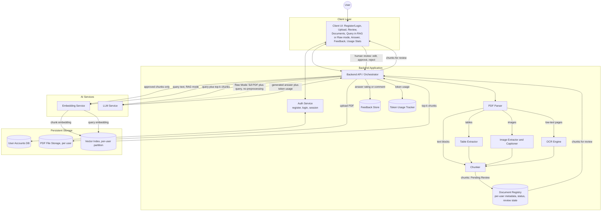
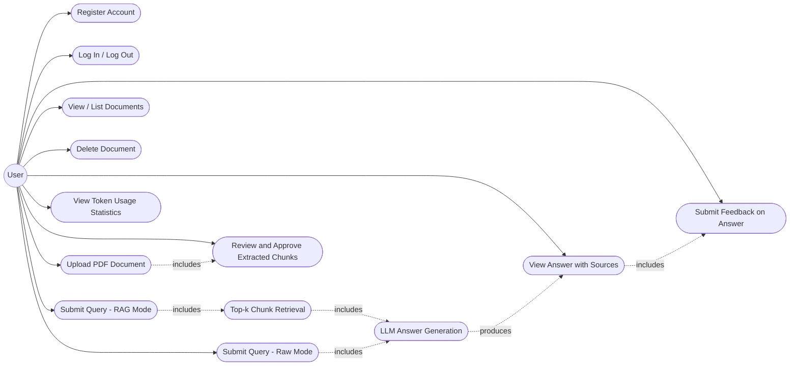
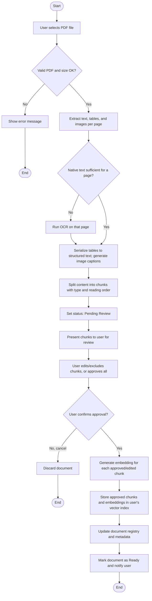
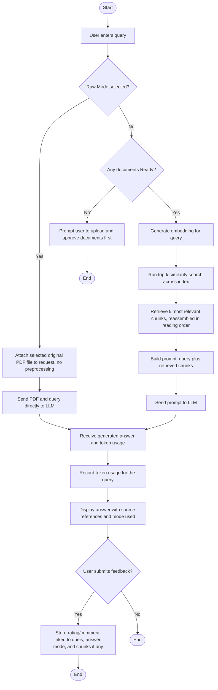
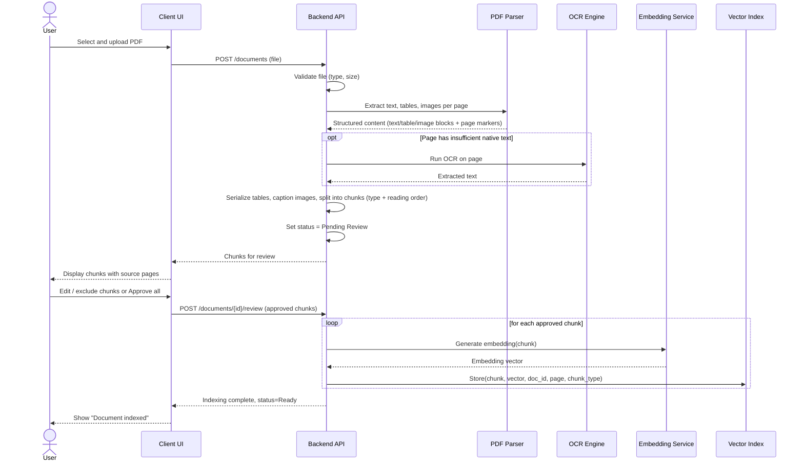
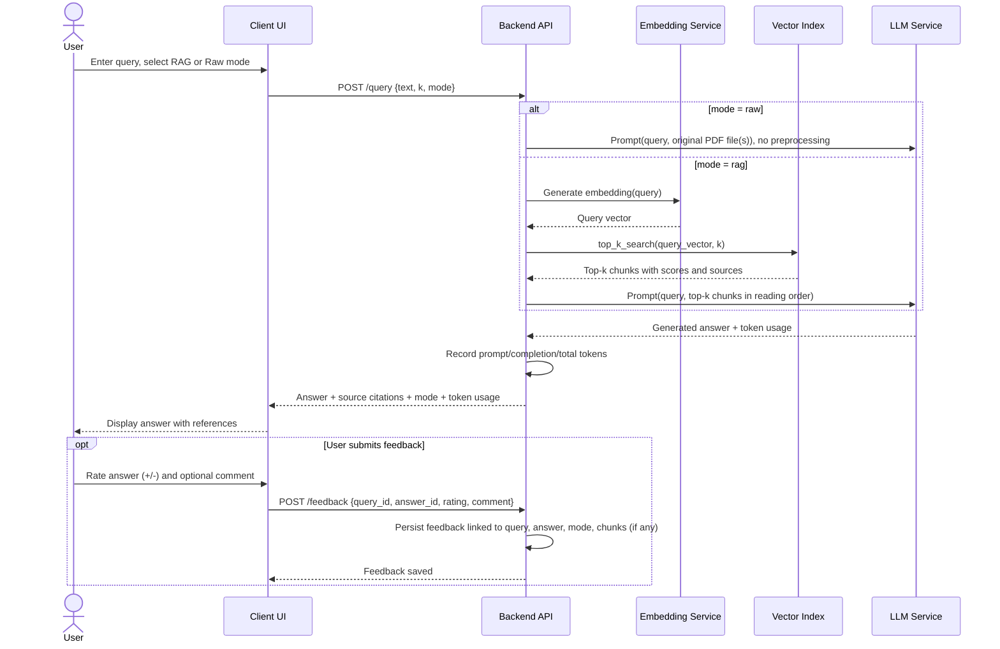

# Software Requirements Specification (SRS)
## PDF Question-Answering System (Retrieval-Augmented Generation)

**Version:** 2.0
**Date:** 2026-09-11
**Status:** Draft

---

## 1. Introduction

### 1.1 Purpose
This document specifies the software requirements for a multi-user system that allows registered users to upload PDF documents and ask natural-language questions about their content. By default, the system retrieves the most relevant passages using a **top-k similarity search** and passes them, together with the user's query, to a Large Language Model (LLM) to generate a grounded answer (Retrieval-Augmented Generation, RAG). On request, a user may instead use an unprocessed **Raw Mode** that sends the original PDF file(s) and query directly to the LLM. The system incorporates **human-in-the-loop (HITL)** checkpoints — the user reviews and approves extracted/chunked content before it is indexed, and the user can rate generated answers to support future improvement — and tracks **token usage** for performance/cost evaluation.

### 1.2 Scope
The system:
- Requires each user to **register and log in**; a user's documents, queries, answers, and feedback are isolated from other users.
- Accepts PDF files uploaded directly by the authenticated user.
- Extracts text, tables, and images from each PDF, applying **OCR** to pages where native text extraction is insufficient (e.g., scanned pages).
- Lets the user **review and approve** extracted/chunked content before it is embedded and indexed (human-in-the-loop).
- Generates vector embeddings for approved chunks and stores them in a vector index, partitioned per user.
- Accepts a user query and, by default, retrieves the top-k most relevant chunks and sends them with the query to an LLM (**RAG Mode**).
- Provides an opt-in **Raw Mode**: on explicit user request, sends the selected PDF(s) and the query directly to the LLM with no chunking, retrieval, or other preprocessing.
- Returns an LLM-generated answer, along with references to the source document(s)/page(s) used (RAG Mode) or the source file(s) sent (Raw Mode).
- Calculates or retrieves **token usage** (prompt/completion/embedding tokens) for each query, for performance and cost evaluation.
- Lets the user submit **feedback** (rating/comment) on generated answers, stored for future improvement of retrieval and prompting (human-in-the-loop).
- Is designed to operate reliably with a corpus on the order of **~100 PDF documents per user**.

Out of scope for this version (see §13 for future work): ingesting non-PDF sources such as GitHub repositories; graph-based knowledge representation; real-time/online application of feedback to retrieval ranking; hybrid (dense + sparse) retrieval and re-ranking as a production feature (discussed as a design option in §3.3 but not implemented here); document sharing/collaboration between users; and support for non-PDF file formats (DOCX, TXT, HTML).

### 1.3 Definitions, Acronyms, Abbreviations
| Term | Definition |
|---|---|
| RAG | Retrieval-Augmented Generation — generating answers using retrieved context passed to an LLM |
| RAG Mode | The default query mode: query and PDFs are preprocessed (chunked, embedded, retrieved via top-k) before reaching the LLM |
| Raw Mode | An opt-in query mode: the original PDF file(s) and the query are sent directly to the LLM with no chunking, retrieval, or preprocessing |
| Chunk | A segment of content (text, table, or image) extracted from a document, sized/tagged for embedding and retrieval |
| Embedding | A numeric vector representation of text, used for similarity search |
| Top-k | Retrieval strategy that returns the *k* most similar chunks to a query, ranked by vector similarity |
| Vector Index / Vector Store | A data structure/database optimized for nearest-neighbor search over embeddings |
| LLM | Large Language Model used to generate the final natural-language answer |
| HITL | Human-in-the-loop — a checkpoint where a human reviews, corrects, approves, or rates system output before it is finalized or used for future improvement |
| OCR | Optical Character Recognition — extracting text from scanned/image-based page content |
| Token Usage | The number of tokens consumed by a request (prompt, completion, and/or embedding tokens), used to evaluate cost and performance |

### 1.4 References
- IEEE Std 830-1998, Recommended Practice for Software Requirements Specifications
- Project discovery notes (user-provided constraints: PDF-based QA, ~100-document scale per user, top-k retrieval, human-in-the-loop review and feedback, multi-user authentication, opt-in raw/unprocessed mode, token-usage tracking, OCR for scanned PDFs, Python-based RAG stack)

### 1.5 Overview
Section 2 describes the product context and constraints. Section 3 explains the key design rationale behind multi-modal chunking, the feedback loop, and the choice of top-k retrieval. Section 4 lists functional requirements. Section 5 lists non-functional requirements. Section 6 covers external interfaces. Section 7 defines the recommended Technology Stack. Section 8 gives the architecture view. Sections 9–11 present the Use Case, Activity, and Sequence diagrams. Section 12 outlines the data model. Section 13 lists open items for future iterations.

---

## 2. Overall Description

### 2.1 Product Perspective
A multi-user web application (client + backend service) with account registration and login. Each user's documents, chunks, queries, answers, and feedback are logically isolated. The system depends on: PDF parsing (text/table/image extraction), an OCR engine, an embedding model, an LLM (called via API or hosted locally, supporting both RAG-mode prompts and Raw-mode PDF+query submissions), and two human-in-the-loop checkpoints built into its workflow.

### 2.2 Product Functions (Summary)
- Register and log in; keep each user's data isolated.
- Upload and ingest PDF documents, including OCR for scanned pages and structured handling of tables and images.
- Present extracted content to the user for **review and approval** before indexing.
- Generate embeddings and index only approved/edited chunks.
- List and manage (delete) previously uploaded documents.
- Accept a natural-language query and, by default, return an LLM-generated, source-grounded answer using top-k retrieval (RAG Mode).
- Accept a query in **Raw Mode**, sending the original PDF(s) and query directly to the LLM with no preprocessing, when the user explicitly requests it.
- Calculate/record token usage per query for performance and cost evaluation.
- Collect user **feedback** on generated answers/retrieval quality for later, offline improvement.

### 2.3 User Characteristics
Multiple registered, non-technical end users, each uploading and managing their own PDF files (e.g., reports, manuals, papers, contracts), reviewing extracted content, asking questions in plain language, optionally using Raw Mode for a quick unprocessed answer, and optionally rating the answers received. No training in retrieval or ML concepts is assumed.

### 2.4 Constraints
- Users must register and authenticate; a user shall only access their own documents, queries, answers, and feedback.
- The corpus size is expected to reach roughly **100 PDF documents per user**; the design must remain responsive at this scale (see NFRs in §5).
- By default, retrieval must use a **top-k similarity search** strategy (not full-text/keyword search); see §3.3 for the rationale and alternatives considered.
- In RAG Mode, answers must be generated by an LLM using retrieved chunks as context, not by returning raw chunks alone.
- Raw Mode is opt-in per query, not a silent default, since it sends the full PDF content to the LLM on every call and typically costs more tokens/time than RAG Mode.
- A document's extracted/chunked content shall not be embedded and indexed until the user has reviewed and approved it (human-in-the-loop ingestion checkpoint).
- OCR shall only be invoked for pages where native text extraction is insufficient, to avoid unnecessary processing cost.
- Feedback collected after an answer is generated is used only for later, offline improvement (see §3.2); it is not required for, and does not block, normal operation.

### 2.5 Assumptions and Dependencies
- Most PDFs are primarily text-based; a subset may be scanned/image-based and require OCR.
- An embedding service/model, an OCR engine, and an LLM (local or API-based, and capable of accepting either preprocessed context or a raw PDF file) are available to the backend.
- The user has sufficient storage for their uploaded PDFs and the generated vector index.
- The user is willing and available to perform the review step for each uploaded document; a bulk "approve all" option is provided to keep this practical at the ~100-document-per-user scale.
- The LLM/embedding provider's API reports token usage; where it does not, a local tokenizer-based estimate is used instead.

---

## 3. Design Rationale & Key Technical Decisions

This section documents the answers to three open design questions raised during review, so the reasoning is preserved alongside the requirements it informs.

### 3.1 Handling Chunked Text, Tables, and Images Together
During parsing, each PDF page is decomposed by content type rather than treated as a single text blob:
- **Text blocks** are extracted as plain text.
- **Tables** are detected and serialized into a structured, indexable form (e.g., a Markdown table) instead of being flattened into paragraph text, so row/column structure is preserved for the LLM to reason over (FR-8).
- **Images/figures** are extracted as files; since raw pixel data is not directly comparable to text embeddings in this design, each image is given an indexable caption/description (from any nearby caption text in the PDF, or auto-generated) while the original image file is retained and linked (FR-9).

All three chunk types share one chunk schema and are embedded into the same vector space so a single top-k search can return a mix of text, table, and image-caption chunks. Each chunk record carries a `chunk_type` (`text` | `table` | `image`) and a `reading_order` index within its page (see §12). When retrieval returns multiple chunks from the same page or table, the backend reassembles them in their original reading order before building the LLM prompt (FR-18), rather than presenting the LLM with an unordered bag of fragments — this keeps multi-part content (e.g., a paragraph referring to an adjacent table) coherent in the final prompt.

### 3.2 Using User Feedback to Improve System Performance
Feedback (FR-23, FR-24) is captured per answer and linked to the query, the answer, the chunks actually used (in RAG Mode), and the mode used. In this version it is used as follows:
- **Quality monitoring:** aggregating ratings per document or chunk surfaces weak spots — e.g., a chunk or document that repeatedly receives negative feedback may indicate poor OCR, bad table parsing, or a chunk boundary that cuts off relevant context.
- **Retrieval evaluation:** feedback tied to the specific chunks used for an answer acts as an implicit relevance judgment. Over time this becomes a small labeled dataset the team can use to estimate retrieval precision (e.g., precision@k) and compare configurations (chunk size, k, embedding model).
- **Prompt/parameter tuning:** recurring patterns in negative feedback (e.g., "wrong document", "answer not grounded in the text") can guide manual adjustments to chunk size, the value of k, or the prompt template.
- **Future automation:** the accumulated (query, retrieved chunks, answer, rating) records can later feed a re-ranking model or few-shot prompt examples; this is intentionally deferred to future work (§13) so the current release keeps a simple, auditable, offline feedback loop rather than an opaque online one.

In the current scope, feedback is stored and reviewable (e.g., by exporting or querying the Feedback table), but is **not** automatically applied in real time; real-time/online incorporation of feedback into ranking is explicitly out of scope for this version (§13).

### 3.3 Top-k Retrieval: Rationale and Alternatives
**What it does:** top-k ranks all indexed chunks by vector similarity to the query embedding and returns the *k* highest-scoring ones.

**Why it was chosen as the default:**
- Simple to implement and reason about, with a small, well-understood parameter (*k*).
- Fast at this project's scale, especially with an approximate-nearest-neighbor index (NFR-8).
- Finds semantically related passages even when the query does not share exact keywords with the source text — the main advantage over pure keyword search.
- Embedding-model agnostic: works with any embedding function without hand-written matching rules.
- Cost and latency scale predictably with *k*, which keeps token usage (§5.8) easier to reason about.

**Alternatives considered, and when they would be better:**
| Method | Advantage over plain top-k | Trade-off |
|---|---|---|
| Keyword / BM25 (sparse) search | Strong for exact terms, codes, numbers, names that embeddings can miss | Misses paraphrased/semantically related content |
| Hybrid search (dense + sparse, e.g., score fusion) | Combines both strengths above | More moving parts to build, tune, and maintain |
| Cross-encoder re-ranking on top of top-k | Higher precision by re-scoring a small candidate set with a more accurate (but slower) model | Adds latency and cost; only re-scores what top-k already retrieved |
| Graph-based retrieval | Better for multi-hop/relational questions ("what does document A say that relates to a table in document B?") | Requires building and maintaining a knowledge graph |

**Conclusion:** plain top-k similarity search is used as the primary/default retrieval method because it gives the best balance of simplicity, latency, and answer quality at the ~100-document-per-user scale defined in this SRS. Because retrieval is already isolated behind a single interface in the architecture (the Vector Index component in §8), hybrid search, re-ranking, or graph-based retrieval can be layered in later (§13) without a fundamental redesign.

---

## 4. Functional Requirements

### 4.1 Authentication & Accounts
| ID | Requirement |
|---|---|
| FR-1 | The system shall allow a new user to register an account (e.g., username/email and password). |
| FR-2 | The system shall allow a registered user to log in and log out; the system shall maintain a session/token identifying the authenticated user for subsequent requests. |
| FR-3 | The system shall isolate each user's documents, chunks, queries, answers, and feedback so that one user cannot access another user's data. |

### 4.2 Document Upload & Ingestion (OCR, Tables, Images, HITL Review)
| ID | Requirement |
|---|---|
| FR-4 | The system shall allow an authenticated user to upload one or more PDF files through the client interface. |
| FR-5 | The system shall validate uploaded files (file type = PDF, file size within a configurable limit) before processing. |
| FR-6 | The system shall extract content from each accepted PDF per page, separating it into text blocks, tables, and images, each tagged with page number and reading-order position (see §3.1). |
| FR-7 | For pages where native text extraction yields insufficient content (e.g., scanned/image-based pages), the system shall run OCR to extract text before chunking. |
| FR-8 | The system shall serialize detected tables into a structured, indexable form (e.g., a Markdown table) rather than flattening them into plain paragraph text. |
| FR-9 | The system shall generate a caption/description for extracted images to serve as their indexable text, while retaining a link to the original image file. |
| FR-10 | The system shall split extracted content (including OCR output, serialized tables, and image captions) into chunks of configurable size, preserving traceability to the source document, page number, chunk type, and reading order. |
| FR-11 | **(HITL)** The system shall present the extracted chunks to the user for review, setting the document status to "Pending Review", before any embedding or indexing occurs. |
| FR-12 | **(HITL)** The system shall allow the user to edit chunk text, exclude/reject individual chunks, or approve all chunks in bulk for a document. |
| FR-13 | The system shall generate a vector embedding for each approved or user-edited chunk only, and store it in the vector index with its source metadata, only after the user confirms the review. |
| FR-14 | The system shall display the list of the current user's documents and their status (e.g., Uploaded, Extracting, OCR, Pending Review, Indexing, Ready, Failed). |
| FR-15 | The system shall allow the user to delete a previously uploaded document, removing its file, chunks (including any pending review data), and embeddings from the index. |

### 4.3 Querying — RAG Mode and Raw Mode
| ID | Requirement |
|---|---|
| FR-16 | The system shall accept a free-text query from the user. |
| FR-17 | By default (RAG Mode), the system shall generate an embedding for the query and perform a **top-k nearest-neighbor search** over the vector index to retrieve the k most relevant chunks (see §3.3). |
| FR-18 | When multiple retrieved chunks originate from the same page/section, the system shall reassemble them in their original reading order before building the LLM prompt (see §3.1). |
| FR-19 | The system shall construct a prompt combining the user's query and the retrieved top-k chunks, and send it to the LLM (RAG Mode). |
| FR-20 | The system shall provide a **Raw Mode** option that, when explicitly selected by the user for a given query, sends the selected PDF file(s) and the query directly to the LLM with no chunking, retrieval, or other preprocessing. |
| FR-21 | The system shall clearly indicate to the user which mode (RAG or Raw) was used to produce a given answer. |
| FR-22 | The system shall present the LLM-generated answer to the user, along with references to the source document(s)/page(s) used (RAG Mode) or the source file(s) sent (Raw Mode). |

### 4.4 Feedback (HITL)
| ID | Requirement |
|---|---|
| FR-23 | **(HITL)** The system shall allow the user to submit feedback on a generated answer (e.g., positive/negative rating, optional free-text comment). |
| FR-24 | **(HITL)** The system shall persist submitted feedback, linked to the originating query, answer, mode used, and chunks used (if RAG Mode), for later review and improvement of retrieval and prompting (see §3.2). |

### 4.5 Token Usage & Evaluation
| ID | Requirement |
|---|---|
| FR-25 | The system shall calculate or retrieve (from the LLM/embedding provider's API response) the number of tokens consumed by each query — prompt tokens, completion tokens, and, where applicable, embedding tokens — and store this with the corresponding query/answer record. |
| FR-26 | The system shall allow the user to view token-usage figures per query and in aggregate, to support performance/cost evaluation. |

### 4.6 Configuration & Error Handling
| ID | Requirement |
|---|---|
| FR-27 | The system shall allow the user to configure the value of *k* (number of retrieved chunks) within a sensible default range, if advanced settings are exposed. |
| FR-28 | The system shall handle and surface errors gracefully at each stage (registration/login, upload, parsing, OCR, review submission, embedding, LLM generation in either mode, feedback submission, token accounting) with a user-readable message. |
| FR-29 | The system shall avoid re-processing (re-extracting/re-OCR'ing/re-chunking/re-reviewing/re-embedding) a document that has already been approved and indexed, unless the user explicitly re-uploads or updates it. |

---

## 5. Non-Functional Requirements

### 5.1 Performance
- NFR-1: Ingesting a typical PDF (≈20–50 pages) shall complete extraction and chunking, up to presenting it for review, within a target time (e.g., ≤ 30 seconds), excluding OCR and external LLM/embedding network latency.
- NFR-2: When triggered, OCR shall add no more than approximately 5 seconds per scanned page to ingestion time under normal conditions.
- NFR-3: A top-k query against an index sized for a full ~100-document corpus shall return retrieved chunks within ≤ 2 seconds (excluding LLM generation time).
- NFR-4: End-to-end RAG Mode query response (retrieval + LLM answer) should target ≤ 10–15 seconds under normal conditions.
- NFR-5: Raw Mode responses are not bound by NFR-4, since they involve sending full PDF content and skip retrieval; the UI shall indicate that Raw Mode may take longer and cost more tokens than RAG Mode.

### 5.2 Scalability (with emphasis on the ~100-PDF-per-user scale)
- NFR-6: The vector index must efficiently support the volume expected from ~100 PDFs per user (estimated tens of thousands of chunks per user). An in-memory-only structure with no persistence is **not** acceptable; the index shall be persisted to disk so the application can restart without full re-ingestion.
- NFR-7: The indexing/embedding pipeline shall support batch processing so multiple uploaded PDFs can be ingested (up to the review checkpoint) without blocking the UI or degrading query performance for already-indexed documents.
- NFR-8: The chosen vector index/search method shall be selected (or configured) so that top-k search time grows sub-linearly (e.g., approximate nearest neighbor) as a user's corpus grows beyond the initial ~100-document target.
- NFR-9: The architecture shall support multiple registered user accounts, each with their own documents and index partition, without requiring redesign of the ingestion or retrieval pipelines (i.e., `user_id` is a first-class filter/partition key throughout).

### 5.3 Reliability
- NFR-10: A failure while ingesting one document shall not corrupt the index or affect retrieval for already-indexed documents (for that user or others).
- NFR-11: The system shall not lose previously indexed documents/embeddings, pending-review chunks, stored feedback, or user accounts on restart (persistence required — see NFR-6).
- NFR-12: A failure in OCR, table extraction, or image captioning on a single page shall not fail the entire document's ingestion; the affected page shall be flagged and the rest of the document processed normally.

### 5.4 Usability
- NFR-13: Upload and ingestion status shall be visible to the user at every stage, including "Pending Review".
- NFR-14: Answers shall clearly indicate which document(s)/page(s) they are based on (RAG Mode) or which file(s) were sent (Raw Mode), so the user can verify the source.
- NFR-15: The UI shall clearly label which mode — RAG or Raw — is active before a query is submitted and which mode produced a given answer, given their differing cost, latency, and privacy characteristics.

### 5.5 Security & Privacy
- NFR-16: The system shall require authentication for all document, query, and feedback operations; passwords shall be stored using a strong one-way hash (e.g., bcrypt), never in plain text.
- NFR-17: Each user's documents, chunks, queries, answers, and feedback shall be isolated at the data layer so no user can read or modify another user's data.
- NFR-18: Temporary files and extracted text shall be handled securely and deleted upon document deletion (FR-15).
- NFR-19: Because Raw Mode sends the entire PDF to the LLM provider on every query (rather than only the top-k relevant chunks), it exposes more document content per request than RAG Mode; the system shall require the user to explicitly opt into Raw Mode per query rather than defaulting to it.

### 5.6 Maintainability
- NFR-20: Chunking size, top-k value, embedding model, and LLM provider shall be configurable without code changes (e.g., via a configuration file).

### 5.7 Human-in-the-Loop Usability & Data Handling
- NFR-21: The chunk review step shall support a bulk "approve all" action so human review does not become a bottleneck when ingesting a corpus approaching ~100 documents per user.
- NFR-22: The review UI shall present each chunk's content together with its source page and type (text/table/image), so the user can verify extraction correctness without opening the original PDF.
- NFR-23: Feedback data (ratings/comments) shall be stored persistently and linked to its corresponding query, answer, and chunks, but submitting feedback shall remain optional and shall never block the user from continuing to use the system.

### 5.8 Observability & Cost Tracking
- NFR-24: The system shall record token usage (prompt, completion, and, where applicable, embedding tokens) for every query, preferring the figures reported directly by the LLM/embedding provider's API response, and falling back to a local tokenizer-based estimate only when the provider does not report usage.
- NFR-25: Token usage shall be viewable both per individual query and in aggregate (e.g., per document, per day), to support ongoing performance and cost evaluation.

---

## 6. External Interface Requirements

### 6.1 User Interface
A client (web) providing: registration/login screens; a document upload/list/delete view; a chunk-review view (approve/edit/reject with bulk approve, showing chunk type and source page); a query view with an explicit RAG/Raw mode toggle; an answer view with citations, mode indicator, and a feedback control; and a token-usage/statistics view.

### 6.2 Software Interfaces
- **PDF Parsing Library** — extracts raw text, tables, images, and page boundaries from PDF files.
- **OCR Engine** — extracts text from scanned/image-based pages.
- **Embedding Service/Model** — converts text/table/image-caption chunks and queries into vectors (local model or external API).
- **Vector Index/Store** — persists embeddings, partitioned per user, and supports top-k nearest-neighbor search.
- **LLM Service** — generates the final answer either from a RAG-style prompt (query + retrieved chunks) or, in Raw Mode, directly from the original PDF file(s) and query; reports token usage.
- **Authentication mechanism** — issues and validates a session/token per logged-in user.

### 6.3 Hardware Interfaces
None beyond standard storage and, optionally, GPU acceleration for embedding, OCR, or LLM inference if run locally.

### 6.4 Communication Interfaces
HTTP(S) REST between client UI and backend, with a session/authentication token (e.g., a bearer token) included in requests after login; outbound HTTPS calls if embedding, OCR, or LLM services are external APIs.

---

## 7. Technology Stack

A standard, widely-adopted **Python-based RAG stack**, appropriate for a multi-user system operating at the ~100-document-per-user scale defined in this SRS. Exact components remain swappable per NFR-20.

| Layer | Component | Recommended Technology | Notes / Alternatives |
|---|---|---|---|
| Language | Core language | Python 3.11+ | — |
| Backend | API framework | FastAPI | Async support, auto-generated OpenAPI docs |
| Backend | Authentication | FastAPI's OAuth2/JWT pattern (`python-jose`) + `passlib[bcrypt]` for password hashing | Alternative: a session-cookie-based auth library if JWT is not desired |
| Client | UI | Streamlit, or a lightweight React/Next.js front-end | Streamlit is fastest to build for this scope; React/Next.js if a more custom multi-page UI (login, review, chat, stats) is preferred |
| Ingestion | PDF text/layout parsing | PyMuPDF (`fitz`) | Fast text + page-level extraction; alternative: `pdfplumber` |
| Ingestion | Table extraction | Camelot or `pdfplumber` table detection | Serializes detected tables to Markdown (§3.1, FR-8) |
| Ingestion | Image extraction & captioning | PyMuPDF for image extraction; captioning via a vision-capable LLM call or a local model (e.g., BLIP) | Configurable per NFR-20 |
| Ingestion | OCR | Tesseract OCR via `pytesseract` | Alternative: a cloud OCR API for higher accuracy on difficult scans |
| Ingestion | Chunking & RAG orchestration | LangChain (or LlamaIndex) | Text splitters and RAG pipeline glue |
| AI Services | Embedding model | `sentence-transformers` (e.g., `all-MiniLM-L6-v2`), local | Alternative: an API-based embedding model for higher quality |
| Storage | Vector store | Chroma | Embedded, persistent, supports per-user partitioning/filtering at the ~100-document, tens-of-thousands-of-chunk scale; alternatives: FAISS, Qdrant |
| AI Services | LLM (RAG & Raw Mode) | Configurable — an API-based LLM by default (supports both text prompts and file/document input for Raw Mode) | Optional local inference (e.g., via Ollama) for offline use |
| AI Services | Token accounting | Provider-reported `usage` fields (prompt/completion/embedding tokens) | `tiktoken`-based local estimate as a fallback (NFR-24) |
| Storage | Users, metadata, review status, feedback, token usage | SQLite | Lightweight, file-based; stores the User, Document, Chunk (with review status), Query, Answer, and Feedback records from §12. For a larger number of concurrent users, migrating to PostgreSQL is a maintainability consideration, not a required change now. |
| Deployment | Packaging | Docker | Single container (or docker-compose) bundling backend, vector store, and database |
| Quality | Testing | pytest | Unit/integration tests for auth, ingestion, retrieval, and API layers |

---

## 8. System Architecture Overview

The backend orchestrates four flows: **authentication** (register/login/session), **ingestion with human review** (parse → OCR/tables/images as needed → chunk → present for review → embed & index approved chunks), **querying** in RAG Mode or Raw Mode, and **feedback/token-usage capture**. All per-user data (files, index entries, registry, feedback, token usage) is partitioned by `user_id`.

**Layer summary**

| Layer | Component | Responsibility |
|---|---|---|
| Client | Client UI | Register/log in, upload PDFs, review/approve/edit chunks, list/delete documents, submit queries in RAG or Raw mode, display answers with citations, submit feedback, show token-usage stats |
| Backend | Auth Service | Handles registration, login/logout, and session/token validation |
| Backend | Backend API / Orchestrator | Coordinates auth, ingestion (incl. review), query (both modes), feedback, and token-usage flows |
| Backend | PDF Parser | Extracts raw text, tables, images, and page boundaries from uploaded PDFs |
| Backend | Table Extractor | Detects tables and serializes them into structured, indexable text |
| Backend | Image Extractor and Captioner | Extracts images and generates indexable captions/descriptions |
| Backend | OCR Engine | Extracts text from scanned/image-based pages |
| Backend | Chunker | Splits extracted content into indexable, page- and order-traceable chunks |
| Backend | Document Registry | Tracks per-user document metadata, ingestion status, and per-chunk review state |
| Backend | Feedback Store | Persists user ratings/comments on answers, linked to query, answer, mode, and chunks used |
| Backend | Token Usage Tracker | Records prompt/completion/embedding token counts per query |
| AI Services | Embedding Service | Converts approved chunks and queries into vectors |
| AI Services | LLM Service | Generates the final answer, either from RAG-style context or directly from a raw PDF plus query (Raw Mode); reports token usage |
| Storage | User Accounts DB | Stores registered users and hashed credentials |
| Storage | PDF File Storage | Persists the original uploaded PDF files, per user |
| Storage | Vector Index / Store | Persists **approved** chunk embeddings and metadata, partitioned per user; serves top-k similarity search (NFR-6) |

---

## 9. Use Case Diagram

### 9.1 Use Case Descriptions (Key Cases)

**UC0 / UC0b — Register / Log In / Log Out**
- *Actor:* User
- *Main flow:* User registers with a username/email and password (hashed and stored) or logs in with existing credentials; the system issues a session/token used to scope all subsequent requests to that user (FR-1–FR-3).

**UC1 — Upload PDF Document (includes UC8)**
- *Actor:* Authenticated User
- *Precondition:* User has a PDF file locally.
- *Main flow:* User selects a PDF → system validates it → extracts text/tables/images per page, applying OCR where native text is insufficient (§3.1) → sets status to "Pending Review" → user reviews and approves the chunks (UC8) → system generates embeddings for approved chunks → stores them in the user's index partition → marks document as "Ready".
- *Postcondition:* Document is searchable via queries.

**UC8 — Review and Approve Extracted Chunks**
- *Actor:* User
- *Precondition:* A document's content has been extracted and chunked; status is "Pending Review".
- *Main flow:* System displays each chunk (text, table, or image) with its source page → user edits chunk content and/or excludes individual chunks, or uses "approve all" → user confirms → only approved/edited chunks proceed to embedding.
- *Postcondition:* Only human-approved content enters the vector index.

**UC4 — Submit Query, RAG Mode (includes UC6, UC7)**
- *Actor:* User
- *Precondition:* At least one document is indexed (status "Ready").
- *Main flow:* User enters a question → system embeds the query → performs top-k similarity search (UC6) → reassembles retrieved chunks in reading order (§3.1) → builds a prompt → sends it to the LLM (UC7) → displays the generated answer with source references (UC5).

**UC10 — Submit Query, Raw Mode (includes UC7)**
- *Actor:* User
- *Precondition:* User has explicitly selected Raw Mode for this query and selected which PDF file(s) to send.
- *Main flow:* User enters a question and selects Raw Mode → system sends the original PDF file(s) and the question directly to the LLM with no chunking or retrieval (UC7) → displays the generated answer, labeled as Raw Mode, with the source file(s) noted (UC5).

**UC9 — Submit Feedback on Answer**
- *Actor:* User
- *Precondition:* An answer has just been displayed (UC5), from either mode.
- *Main flow:* User optionally rates the answer (positive/negative) and/or adds a comment → system stores the feedback linked to the query, answer, mode, and chunks used (if any).
- *Postcondition:* Feedback is available for later, offline review and improvement (§3.2); the answer remains usable regardless of whether feedback is submitted.

**UC11 — View Token Usage Statistics**
- *Actor:* User
- *Main flow:* User opens the usage view → system displays token usage (prompt/completion/embedding) per query and in aggregate (FR-25, FR-26).

---

## 10. Activity Diagrams

### 10.1 Activity Diagram — PDF Upload & Ingestion (OCR, Tables, Images, Human Review)

### 10.2 Activity Diagram — Query, Answer Generation & Feedback (RAG Mode and Raw Mode)

---

## 11. Sequence Diagrams

### 11.1 Sequence Diagram — Document Upload with OCR and Human Review

### 11.2 Sequence Diagram — Query, Answer Generation & Feedback (RAG or Raw Mode)

---

## 12. Data Requirements (Data Model)

| Entity | Key Attributes |
|---|---|
| User | id, username/email, password_hash, created_at |
| Document | id, user_id, filename, upload_date, status (uploaded/extracting/ocr/pending_review/indexing/ready/failed), page_count |
| Chunk | id, document_id, page_number, chunk_type (text/table/image), text (or table_markdown / image_caption), image_path (nullable), reading_order, review_status (pending/approved/edited/rejected), reviewed_at |
| Embedding | chunk_id, vector, embedding_model_version |
| Query | id, user_id, text, timestamp, k_value, mode (rag/raw) |
| Answer | id, query_id, generated_text, source_chunk_ids (nullable for Raw Mode), llm_model_version, prompt_tokens, completion_tokens, total_tokens |
| Feedback | id, query_id, answer_id, rating (positive/negative), comment, timestamp |

---

## 13. Appendix — Open Items for Future Iterations (Not in Current Scope)
- Ingesting and processing **GitHub repositories** as an additional content source alongside PDFs.
- **Graph-based knowledge representation** (cross-document and/or document-structural graphs) to support relational and multi-hop queries, building on the retrieval alternatives discussed in §3.3.
- **Real-time/online application of user feedback** to retrieval ranking or prompting; the current version stores feedback for offline/manual review only (§3.2).
- **Hybrid (dense + sparse) retrieval and/or cross-encoder re-ranking**, layered on top of the current top-k similarity search, as discussed in §3.3.
- **Multi-user document sharing/collaboration** — the current scope provides per-user isolation only, not sharing.
- Support for additional file formats beyond PDF (DOCX, TXT, HTML).
