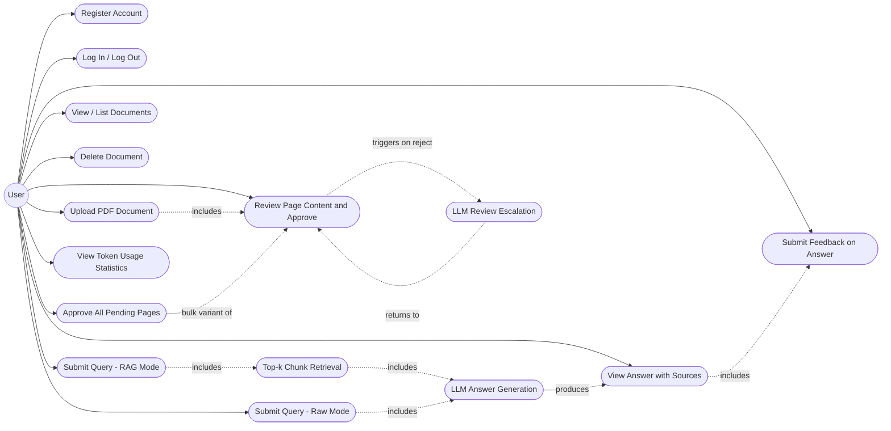

# Software Requirements Specification (SRS)
## PDF Question-Answering System (Retrieval-Augmented Generation)

**Version:** 4.0
**Date:** 2026-09-12
**Status:** Draft

**Companion document:** This SRS is accompanied by a separate **Software Design Document (SDD)** — `SDD_PDF_QA_System.md` — which describes the architecture, technology stack, design rationale, and diagrams used to satisfy the requirements below. This SRS states **what** the system must do; the SDD states **how** it will be built.

---

## 1. Introduction

### 1.1 Purpose
This document specifies the software requirements for a multi-user system that allows registered users to upload PDF documents and ask natural-language questions about their content. Each uploaded PDF is split into pages and processed **page by page**, with a staged, human-in-the-loop (HITL) review of the extracted content before anything is indexed. By default, the system answers questions using a **top-k similarity search** over indexed content, passed to a Large Language Model (LLM) to generate a grounded answer (Retrieval-Augmented Generation, RAG). On request, a user may instead use an unprocessed **Raw Mode** that sends the original PDF file(s) and query directly to the LLM. The system also tracks **token usage** for performance/cost evaluation.

### 1.2 Scope
The system:
- Requires each user to **register and log in**; a user's documents, queries, answers, and feedback are isolated from other users.
- Accepts PDF files uploaded directly by the authenticated user.
- **Splits each PDF into individual pages** and processes each page through a defined status lifecycle: **Initial Processing → Awaiting Feedback → (optionally) LLM Review → Awaiting Feedback → Approved** (or the whole document is discarded — see below).
- In Initial Processing, extracts text, tables, and images (with captions) from each page using native/direct parsing, and computes a **quality score** for that extraction.
- If a page's quality score falls below a configurable threshold, uses **OCR** instead to extract text, tables, and images (with captions) from that page.
- Presents each page's extracted content to the user for **review** ("Awaiting Feedback"); the user may edit/exclude individual chunks, approve the page, or mark it unsatisfactory. An **"Approve All"** action lets the user bulk-approve every page currently awaiting feedback.
- If the user marks a page unsatisfactory on its first review round, escalates to **LLM Review**: renders that page as an image and sends it, with an appropriate prompt, to an LLM (which may be the system's main LLM or a lighter one) to re-extract text, tables, and images (with captions); the result is shown to the user for a second review round.
- If the user is still unsatisfied after LLM Review, **discards the entire PDF document**.
- Generates vector embeddings for approved page content and stores them in a vector index, partitioned per user.
- Accepts a user query and, by default, retrieves the top-k most relevant chunks and sends them with the query to an LLM (**RAG Mode**).
- Provides an opt-in **Raw Mode**: on explicit user request, sends the selected PDF(s) and the query directly to the LLM with no chunking, retrieval, or other preprocessing.
- Returns an LLM-generated answer, along with references to the source document(s)/page(s) used (RAG Mode) or the source file(s) sent (Raw Mode).
- Calculates or retrieves **token usage** for each LLM-consuming operation — both query answering and LLM Review extraction — for performance and cost evaluation.
- Lets the user submit **feedback** (rating/comment) on generated answers, stored for future improvement of retrieval and prompting.
- Is designed to operate reliably with a corpus on the order of **~100 PDF documents per user**.

Out of scope for this version (see §8 for future work): ingesting non-PDF sources such as GitHub repositories; graph-based knowledge representation; real-time/online application of feedback to retrieval ranking; hybrid (dense + sparse) retrieval and re-ranking as a production feature; document sharing/collaboration between users; and support for non-PDF file formats (DOCX, TXT, HTML).

### 1.3 Definitions, Acronyms, Abbreviations
| Term | Definition |
|---|---|
| RAG | Retrieval-Augmented Generation — generating answers using retrieved context passed to an LLM |
| RAG Mode | The default query mode: query and PDFs are preprocessed (chunked, embedded, retrieved via top-k) before reaching the LLM |
| Raw Mode | An opt-in query mode: the original PDF file(s) and the query are sent directly to the LLM with no chunking, retrieval, or preprocessing |
| Page | One page of an uploaded PDF, tracked and reviewed independently as it moves through the ingestion pipeline |
| Initial Processing | The first per-page ingestion status: native extraction of text/tables/images, followed by quality scoring and, if needed, OCR |
| Awaiting Feedback | A per-page status in which extracted content is shown to the user for review/approval; occurs after Initial Processing (Round 1) and again after LLM Review (Round 2) |
| LLM Review | A per-page status in which a page image is sent to an LLM as a fallback extraction method, used only after the user marks the Round-1 result unsatisfactory |
| Quality Score | A configurable metric computed on a page's natively extracted content, used to automatically decide whether OCR is needed |
| Chunk | A segment of content (text, table, or image) extracted from a page, sized/tagged for embedding and retrieval |
| Embedding | A numeric vector representation of text, used for similarity search |
| Top-k | Retrieval strategy that returns the *k* most similar chunks to a query, ranked by vector similarity |
| Vector Index / Vector Store | A data structure/database optimized for nearest-neighbor search over embeddings |
| LLM | Large Language Model used to generate the final natural-language answer, and (as a fallback) to extract page content in LLM Review |
| HITL | Human-in-the-loop — a checkpoint where a human reviews, corrects, approves, or rates system output before it is finalized or used for future improvement |
| OCR | Optical Character Recognition — extracting text, tables, and images from scanned/low-quality page content |
| Token Usage | The number of tokens consumed by an LLM-consuming operation (prompt, completion, and/or embedding tokens), used to evaluate cost and performance |

### 1.4 References
- IEEE Std 830-1998, Recommended Practice for Software Requirements Specifications
- `SDD_PDF_QA_System.md` — companion Software Design Document (architecture, technology stack, design rationale, diagrams)
- Project discovery notes (user-provided constraints: PDF-based QA, ~100-document scale per user, top-k retrieval, page-level human-in-the-loop review with quality-gated OCR and LLM-based extraction escalation, multi-user authentication, opt-in raw/unprocessed mode, token-usage tracking)

### 1.5 Overview
Section 2 describes the product context and constraints. Section 3 lists functional requirements. Section 4 lists non-functional requirements. Section 5 covers external interface requirements. Section 6 presents the Use Case Diagram. Section 7 gives a conceptual view of the data the system must retain. Section 8 lists open items for future iterations.

---

## 2. Overall Description

### 2.1 Product Perspective
A multi-user web application (client + backend service) with account registration and login. Each user's documents, pages, chunks, queries, answers, and feedback are logically isolated. Ingestion is **page-driven**: instead of approving a whole document at once, each page moves through its own review lifecycle, and a document only becomes usable once all of its pages are approved. The system depends on: native PDF parsing, an OCR capability, an LLM capable of page-image-based extraction (for LLM Review), an embedding model, and an LLM for answering queries (supporting both RAG-mode prompts and Raw-mode PDF+query submissions). *How* these dependencies are implemented is defined in the companion SDD.

### 2.2 Product Functions (Summary)
- Register and log in; keep each user's data isolated.
- Upload PDFs and process them **page by page**: native extraction with an automatic quality check, OCR fallback when quality is low, and a two-round human review with an LLM-based extraction fallback for pages the user rejects the first time.
- Let the user bulk-approve all pages currently awaiting feedback ("Approve All").
- Discard an entire document if the user is still unsatisfied with a page's content after the LLM Review round.
- Generate embeddings and index only approved page content.
- List and manage (delete) previously uploaded documents.
- Accept a natural-language query and, by default, return an LLM-generated, source-grounded answer using top-k retrieval (RAG Mode).
- Accept a query in **Raw Mode**, sending the original PDF(s) and query directly to the LLM with no preprocessing, when the user explicitly requests it.
- Calculate/record token usage for both query answering and LLM Review extraction, for performance and cost evaluation.
- Collect user **feedback** on generated answers/retrieval quality for later, offline improvement.

### 2.3 User Characteristics
Multiple registered, non-technical end users, each uploading and managing their own PDF files (e.g., reports, manuals, papers, contracts), reviewing extracted page content (possibly across two rounds per page), asking questions in plain language, optionally using Raw Mode for a quick unprocessed answer, and optionally rating the answers received. No training in retrieval, OCR, or ML concepts is assumed.

### 2.4 Constraints
- Users must register and authenticate; a user shall only access their own documents, pages, queries, answers, and feedback.
- The corpus size is expected to reach roughly **100 PDF documents per user**, each with potentially tens of pages, each reviewed individually; the design must remain responsive at this scale (see NFRs in §4), and bulk review actions must be practical at this volume.
- Each page must pass through its defined status lifecycle (§1.3) before its content is indexed; a document is not usable for querying until all of its pages are Approved.
- OCR shall only be invoked for a page when its quality score (computed automatically) falls below a configurable threshold — not for every page.
- LLM Review shall only be invoked for a page after the user has explicitly marked its Round-1 content unsatisfactory — it is not an automatic step.
- If the user is unsatisfied with a page's content after LLM Review (its second review round), the entire containing document — including any of its other pages already approved — shall be discarded.
- By default, retrieval must use a **top-k similarity search** strategy (not full-text/keyword search); the rationale and alternatives considered are documented in the SDD.
- In RAG Mode, answers must be generated by an LLM using retrieved chunks as context, not by returning raw chunks alone.
- Raw Mode is opt-in per query, not a silent default, since it sends the full PDF content to the LLM on every call and typically costs more tokens/time than RAG Mode.
- Feedback collected after an answer is generated is used only for later, offline improvement; it is not required for, and does not block, normal operation.

### 2.5 Assumptions and Dependencies
- Most PDF pages are primarily text-based; a subset may be scanned/low-quality and require OCR, and a smaller subset may still be unsatisfactory after OCR and require LLM Review.
- An embedding service/model, an OCR capability, and an LLM capable of both page-image-based extraction and text-based generation are available to the backend.
- The user has sufficient storage for their uploaded PDFs and the generated vector index.
- The user is willing and available to review each page's extracted content, potentially across two rounds for difficult pages; the "Approve All" action is provided to keep this practical at scale.
- The LLM/embedding provider's API reports token usage; where it does not, a local estimate is used instead.

---

## 3. Functional Requirements

### 3.1 Authentication & Accounts
| ID | Requirement |
|---|---|
| FR-1 | The system shall allow a new user to register an account (e.g., username/email and password). |
| FR-2 | The system shall allow a registered user to log in and log out; the system shall maintain a session/token identifying the authenticated user for subsequent requests. |
| FR-3 | The system shall isolate each user's documents, pages, chunks, queries, answers, and feedback so that one user cannot access another user's data. |

### 3.2 Document Upload & Page-Level Ingestion Pipeline
| ID | Requirement |
|---|---|
| FR-4 | The system shall allow an authenticated user to upload one or more PDF files through the client interface. |
| FR-5 | The system shall validate uploaded files (file type = PDF, file size within a configurable limit) before processing. |
| FR-6 | The system shall split each accepted PDF into individual pages and track a per-page processing status, independent of the document's overall status. |
| FR-7 | Each page's status shall follow the lifecycle: **Initial Processing → Awaiting Feedback (Round 1) → [LLM Review → Awaiting Feedback (Round 2)] → Approved**, or the containing document is discarded per FR-16. |
| FR-8 | In Initial Processing, the system shall extract text, tables, and images (with captions) from the page using native/direct PDF parsing. |
| FR-9 | The system shall compute a quality score for a page's natively extracted content, using a configurable metric. |
| FR-10 | If a page's quality score is below a configurable threshold, the system shall discard the native-extraction result for that page and instead extract text, tables, and images (with captions) from that page using OCR. |
| FR-11 | After Initial Processing (native extraction or OCR, per FR-9/FR-10), the system shall set the page's status to "Awaiting Feedback" (Round 1) and present the extracted text, tables, and images (with captions) to the user for review. |
| FR-12 | While a page is "Awaiting Feedback", the system shall allow the user to edit or exclude individual extracted chunks, and to either approve the page's content or mark it unsatisfactory. |
| FR-13 | The system shall provide an "Approve All" action that, in a single step, approves every page of a document that is currently in the "Awaiting Feedback" status. |
| FR-14 | If the user marks a page's content unsatisfactory during its first "Awaiting Feedback" round, the system shall set the page's status to "LLM Review", render that page of the PDF as an image, and send it — with an appropriate extraction prompt — to an LLM (which may be the system's main LLM or a lighter/alternative LLM) to extract text, tables, and images (with captions) from the page. |
| FR-15 | The system shall calculate or retrieve token usage for each LLM Review extraction call (FR-14) and store it linked to the corresponding page and document. |
| FR-16 | After LLM Review, the system shall set the page's status back to "Awaiting Feedback" (Round 2) and present the LLM-extracted content to the user for a second round of review. If the user marks this content unsatisfactory as well, the system shall discard the entire PDF document, including any of its other pages already approved. |
| FR-17 | Once a page's content is approved — in either review round — its approved/edited chunks shall proceed to chunking, embedding, and indexing (FR-20–FR-22). |
| FR-18 | The system shall serialize any table detected on a page into a structured, indexable form (e.g., a Markdown table), regardless of whether the page was processed via native extraction, OCR, or LLM Review. |
| FR-19 | The system shall generate a caption/description for each extracted image to serve as its indexable text, while retaining a link to the original image file, regardless of extraction method. |
| FR-20 | The system shall split each approved page's content into chunks of configurable size, preserving traceability to the source document, page, chunk type (text/table/image), and reading order. |
| FR-21 | The system shall generate a vector embedding for each approved or user-edited chunk, and store it in the vector index with its source metadata, only after the corresponding page has been approved. |
| FR-22 | The system shall display the list of the current user's documents and an overall status derived from the aggregate status of their pages (e.g., Uploaded, Processing, Awaiting Feedback, Ready, Discarded, Failed). |
| FR-23 | The system shall allow the user to delete a previously uploaded document, removing its file, pages, chunks (including any pending review data), and embeddings from the index. |

### 3.3 Querying — RAG Mode and Raw Mode
| ID | Requirement |
|---|---|
| FR-24 | The system shall accept a free-text query from the user. |
| FR-25 | By default (RAG Mode), the system shall generate an embedding for the query and perform a **top-k nearest-neighbor search** over the vector index to retrieve the k most relevant chunks. |
| FR-26 | When multiple retrieved chunks originate from the same page/section, the system shall reassemble them in their original reading order before building the LLM prompt. |
| FR-27 | The system shall construct a prompt combining the user's query and the retrieved top-k chunks, and send it to the LLM (RAG Mode). |
| FR-28 | The system shall provide a **Raw Mode** option that, when explicitly selected by the user for a given query, sends the selected PDF file(s) and the query directly to the LLM with no chunking, retrieval, or other preprocessing. |
| FR-29 | The system shall clearly indicate to the user which mode (RAG or Raw) was used to produce a given answer. |
| FR-30 | The system shall present the LLM-generated answer to the user, along with references to the source document(s)/page(s) used (RAG Mode) or the source file(s) sent (Raw Mode). |

### 3.4 Answer Feedback (HITL)
| ID | Requirement |
|---|---|
| FR-31 | **(HITL)** The system shall allow the user to submit feedback on a generated answer (e.g., positive/negative rating, optional free-text comment). |
| FR-32 | **(HITL)** The system shall persist submitted answer feedback, linked to the originating query, answer, mode used, and chunks used (if RAG Mode), for later review and improvement of retrieval and prompting. |

### 3.5 Token Usage & Evaluation
| ID | Requirement |
|---|---|
| FR-33 | The system shall calculate or retrieve (from the LLM/embedding provider's API response) the number of tokens consumed by each query — prompt, completion, and, where applicable, embedding tokens — and store this with the corresponding query/answer record. |
| FR-34 | The system shall allow the user to view token-usage figures per query and per page (including LLM Review usage from FR-15), and in aggregate, to support performance/cost evaluation. |

### 3.6 Configuration & Error Handling
| ID | Requirement |
|---|---|
| FR-35 | The system shall allow the user to configure the value of *k* (number of retrieved chunks) within a sensible default range, if advanced settings are exposed. |
| FR-36 | The system shall handle and surface errors gracefully at each stage (registration/login, upload, Initial Processing, quality scoring, OCR, LLM Review, page review, embedding, LLM generation in either query mode, answer feedback, token accounting) with a user-readable message. |
| FR-37 | The system shall avoid re-processing (re-extracting/re-scoring/re-OCR'ing/re-reviewing/re-embedding) a page or document that has already been approved and indexed, unless the user explicitly re-uploads or updates it. |

---

## 4. Non-Functional Requirements

### 4.1 Performance
- NFR-1: Native (Initial Processing) extraction and quality scoring for a single page shall complete within a target time (e.g., ≤ 3 seconds), excluding OCR and any LLM calls.
- NFR-2: When triggered, OCR shall add no more than approximately 5 seconds per page to ingestion time under normal conditions.
- NFR-3: When triggered, LLM Review is an LLM call and is not expected to meet the OCR-level latency target in NFR-2; the UI shall indicate that pages currently in LLM Review may take longer.
- NFR-4: A top-k query against an index sized for a full ~100-document corpus shall return retrieved chunks within ≤ 2 seconds (excluding LLM generation time).
- NFR-5: End-to-end RAG Mode query response (retrieval + LLM answer) should target ≤ 10–15 seconds under normal conditions.
- NFR-6: Raw Mode responses are not bound by NFR-5, since they involve sending full PDF content and skip retrieval; the UI shall indicate that Raw Mode may take longer and cost more tokens than RAG Mode.

### 4.2 Scalability (with emphasis on the ~100-PDF-per-user scale)
- NFR-7: The vector index must efficiently support the volume expected from ~100 PDFs per user. An in-memory-only structure with no persistence is **not** acceptable; the index shall be persisted to disk so the application can restart without full re-ingestion.
- NFR-8: The indexing/embedding pipeline shall support batch processing so multiple uploaded PDFs, and their many pages, can be ingested (up to the review checkpoint) without blocking the UI or degrading query performance for already-indexed documents.
- NFR-9: The chosen vector index/search method shall be selected (or configured) so that top-k search time grows sub-linearly (e.g., approximate nearest neighbor) as a user's corpus grows beyond the initial ~100-document target.
- NFR-10: The architecture shall support multiple registered user accounts, each with their own documents and index partition, without requiring redesign of the ingestion or retrieval pipelines.
- NFR-11: Given that review now happens per page (potentially tens of pages per document, across up to ~100 documents per user), bulk actions such as "Approve All" shall operate on all currently pending pages of a document in a single request, rather than requiring one request per page.

### 4.3 Reliability
- NFR-12: A failure while ingesting one document shall not corrupt the index or affect retrieval for already-indexed documents (for that user or others).
- NFR-13: The system shall not lose previously indexed documents/embeddings, per-page status/history, stored feedback, or user accounts on restart (persistence required — see NFR-7).
- NFR-14: A failure in OCR, table extraction, or image captioning on a single page shall not fail the entire document's ingestion; the affected page shall be flagged and the rest of the document processed normally.
- NFR-15: When a document is discarded (FR-16), any of its pages/chunks already approved and indexed shall also be removed from the index, leaving no orphaned entries.

### 4.4 Usability
- NFR-16: Ingestion status shall be visible to the user at page-level granularity, including "Initial Processing", "Awaiting Feedback", and "LLM Review", not just an overall document status.
- NFR-17: Answers shall clearly indicate which document(s)/page(s) they are based on (RAG Mode) or which file(s) were sent (Raw Mode), so the user can verify the source.
- NFR-18: The UI shall clearly label which mode — RAG or Raw — is active before a query is submitted and which mode produced a given answer.
- NFR-19: The review UI shall clearly indicate, for each page shown as "Awaiting Feedback", which round produced the displayed content (Round 1: native extraction or OCR; Round 2: LLM Review) and, where used, the automatic quality score that triggered OCR.

### 4.5 Security & Privacy
- NFR-20: The system shall require authentication for all document, query, and feedback operations; passwords shall be stored using a strong one-way hash, never in plain text.
- NFR-21: Each user's documents, pages, chunks, queries, answers, and feedback shall be isolated at the data layer so no user can read or modify another user's data.
- NFR-22: Temporary files and extracted text shall be handled securely and deleted upon document deletion (FR-23).
- NFR-23: Because Raw Mode sends the entire PDF to the LLM provider on every query, it exposes more document content per request than RAG Mode; the system shall require the user to explicitly opt into Raw Mode per query rather than defaulting to it.
- NFR-24: Because LLM Review sends a rendered image of a PDF page to an LLM service, the system shall make it visible to the user which of their pages went through LLM Review, so they are aware that page's content was sent to an LLM beyond the standard extraction path.

### 4.6 Maintainability
- NFR-25: Chunk size, top-k value, the quality-score metric and its threshold, the embedding model, and the LLM(s) used for answering and for LLM Review shall all be configurable without code changes.

### 4.7 Human-in-the-Loop Usability & Data Handling
- NFR-26: The "Approve All" action shall let a user approve every pending page of a document in one step, so page-level review does not become a bottleneck at the expected per-document page counts and ~100-document-per-user scale.
- NFR-27: The review UI shall present each chunk's content together with its source page, chunk type (text/table/image), and the extraction round that produced it, so the user can verify correctness without opening the original PDF.
- NFR-28: Answer feedback data (ratings/comments) shall be stored persistently and linked to its corresponding query, answer, and chunks, but submitting it shall remain optional and shall never block the user from continuing to use the system.

### 4.8 Observability & Cost Tracking
- NFR-29: The system shall record token usage for every LLM-consuming operation — including query answering (RAG and Raw Mode) and LLM Review extraction during ingestion — preferring the figures reported directly by the provider's API response, and falling back to a local estimate only when the provider does not report usage.
- NFR-30: Token usage shall be viewable per individual query, per page (for LLM Review calls), and in aggregate (e.g., per document, per day), to support ongoing performance and cost evaluation.

---

## 5. External Interface Requirements

### 5.1 User Interface
A client (web) providing: registration/login screens; a document upload/list/delete view; a per-page review view showing each page's status (Initial Processing / Awaiting Feedback / LLM Review), its extracted chunks (with type and source), edit/exclude/approve controls, a per-document "Approve All" action, and a clear indication when a page has been escalated to LLM Review or a document has been discarded; a query view with an explicit RAG/Raw mode toggle; an answer view with citations, mode indicator, and a feedback control; and a token-usage/statistics view covering both query and LLM Review usage.

### 5.2 Software Interfaces
- **PDF Parsing capability** — extracts raw text, tables, images, and page boundaries from PDF files (native extraction).
- **OCR capability** — extracts text, tables, and images from low-quality/scanned pages.
- **Page rendering capability** — renders a single PDF page as an image for LLM Review.
- **Embedding capability** — converts text/table/image-caption chunks and queries into vectors.
- **Vector Index/Store** — persists embeddings, partitioned per user, and supports top-k nearest-neighbor search.
- **LLM capability** — generates the final answer either from a RAG-style prompt or, in Raw Mode, directly from the original PDF file(s) and query; also performs page-image-based extraction for LLM Review; reports token usage for all of these.
- **Authentication mechanism** — issues and validates a session/token per logged-in user.

### 5.3 Hardware Interfaces
None beyond standard storage and, optionally, GPU acceleration for embedding, OCR, or LLM inference if run locally.

### 5.4 Communication Interfaces
HTTP(S) between client UI and backend, with a session/authentication token included in requests after login; outbound HTTPS calls if embedding, OCR, or LLM capabilities are provided by external APIs.

---

## 6. Use Case Diagram

### 6.1 Use Case Descriptions (Key Cases)

**UC0 / UC0b — Register / Log In / Log Out**
- *Actor:* User
- *Main flow:* User registers with a username/email and password, or logs in with existing credentials; the system issues a session/token used to scope all subsequent requests to that user (FR-1–FR-3).

**UC1 — Upload PDF Document (includes UC8)**
- *Actor:* Authenticated User
- *Precondition:* User has a PDF file locally.
- *Main flow:* User selects a PDF → system validates it → splits it into pages → each page enters Initial Processing (native extraction, quality scoring, OCR if needed) → each page's content is reviewed by the user (UC8) → once every page is Approved, the document is marked "Ready".
- *Postcondition:* Document is searchable via queries, or has been discarded if a page failed review twice (UC12).

**UC8 — Review Page Content and Approve**
- *Actor:* User
- *Precondition:* A page's status is "Awaiting Feedback".
- *Main flow:* System displays the page's extracted chunks (text, table, or image) → user edits/excludes chunks and either approves the page or marks it unsatisfied. If unsatisfied on Round 1, the page is escalated (UC12). If unsatisfied again on Round 2, the whole document is discarded.
- *Postcondition:* Only human-approved page content proceeds to embedding and indexing.

**UC13 — Approve All Pending Pages**
- *Actor:* User
- *Main flow:* User selects "Approve All" for a document → every page currently "Awaiting Feedback" for that document is approved in one action (FR-13).

**UC12 — LLM Review Escalation**
- *Actor:* System (triggered by the user's rejection in UC8)
- *Main flow:* System renders the rejected page as an image, sends it with an extraction prompt to an LLM, records the token usage, and returns the newly extracted content to UC8 for a second review round (FR-14–FR-16).

**UC4 — Submit Query, RAG Mode (includes UC6, UC7)**
- *Actor:* User
- *Precondition:* At least one document is Ready (i.e., all of its pages are Approved).
- *Main flow:* User enters a question → system embeds the query → performs top-k similarity search (UC6) → reassembles retrieved chunks in reading order → builds a prompt → sends it to the LLM (UC7) → displays the generated answer with source references (UC5).

**UC10 — Submit Query, Raw Mode (includes UC7)**
- *Actor:* User
- *Precondition:* User has explicitly selected Raw Mode for this query and selected which PDF file(s) to send.
- *Main flow:* User enters a question and selects Raw Mode → system sends the original PDF file(s) and the question directly to the LLM with no chunking or retrieval (UC7) → displays the generated answer, labeled as Raw Mode, with the source file(s) noted (UC5).

**UC9 — Submit Feedback on Answer**
- *Actor:* User
- *Precondition:* An answer has just been displayed (UC5), from either mode.
- *Main flow:* User optionally rates the answer (positive/negative) and/or adds a comment → system stores the feedback linked to the query, answer, mode, and chunks used (if any).

**UC11 — View Token Usage Statistics**
- *Actor:* User
- *Main flow:* User opens the usage view → system displays token usage (query answering and LLM Review) per query/page and in aggregate (FR-33, FR-34).

---

## 7. Data Requirements (Conceptual)

The system must retain the following kinds of information. Full attribute-level schema (field types, nullability, keys) is defined in the companion SDD, since that is a database-design decision rather than a requirement.

| Entity | What it represents |
|---|---|
| User | A registered account; owns all other data below |
| Document | An uploaded PDF and its overall status, derived from its pages |
| Page | One page of a document, tracked through Initial Processing, Awaiting Feedback, and (if needed) LLM Review, until Approved |
| Chunk | A reviewable, indexable unit of content (text, table, or image) extracted from a page |
| Embedding | The vector representation of an approved chunk, used for top-k retrieval |
| Query | A question submitted by a user, including which mode (RAG/Raw) and settings (e.g., k) were used |
| Answer | The LLM-generated response to a query, including source references |
| Feedback | A user's rating/comment on a given answer |
| Token Usage | A record of tokens consumed by a query or by an LLM Review extraction call |

---

## 8. Appendix — Open Items for Future Iterations (Not in Current Scope)
- Ingesting and processing **GitHub repositories** as an additional content source alongside PDFs.
- **Graph-based knowledge representation** (cross-document and/or document-structural graphs) to support relational and multi-hop queries.
- **Real-time/online application of user feedback** to retrieval ranking or prompting; the current version stores feedback for offline/manual review only.
- **Hybrid (dense + sparse) retrieval and/or cross-encoder re-ranking**, layered on top of the current top-k similarity search.
- **Multi-user document sharing/collaboration** — the current scope provides per-user isolation only, not sharing.
- Support for additional file formats beyond PDF (DOCX, TXT, HTML).
